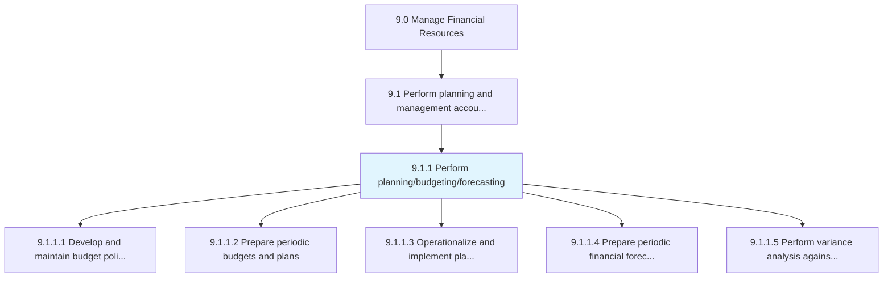
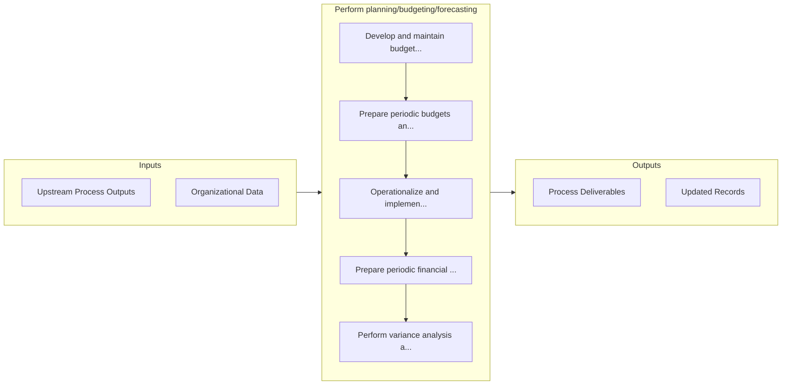

# Perform planning/budgeting/forecasting

> Allocating funds to meet future and current financial goals.

## Overview

Process 9.1.1 is a core process that defines the specific procedures for perform planning/budgeting/forecasting. 

Allocating funds to meet future and current financial goals. Led by the chief financial officer, have the finance function plan, budget, and forecast in order to determine and describe long and short-term financial goals.

## Process Hierarchy



## Key Statistics

| Metric | Value |
|--------|-------|
| APQC Code | 10738 |
| Hierarchy ID | 9.1.1 |
| Level | Process |
| Parent | [9.1](../) |
| Sub-Processes | 5 |


## GraphDL Semantic Structure

```
perform.Planningbudgetingforecasting
```

| Component | Value | Description |
|-----------|-------|-------------|
| Verb | `perform` | Primary action |
| Object | `planning/budgeting/forecasting` | Direct object |


## Process Flow



## Sub-Processes

| Process | Hierarchy ID | Description |
|---------|-------------|-------------|
| [Develop and maintain budget policies and procedures](./DevelopAndMaintainBudgetPoliciesAndProcedures) | 9.1.1.1 | Formulating financial budgetary guidelines and strategies |
| [Prepare periodic budgets and plans](./PreparePeriodicBudgetsAndPlans) | 9.1.1.2 | Creating reports on a quarterly or annual basis for fund allocation |
| [Operationalize and implement plans to achieve budget](./OperationalizeAndImplementPlansToAchieveBudget) | 9.1.1.3 | Putting budgeting plans into practical use keeping within designated forecasting parameters |
| [Prepare periodic financial forecasts](./PreparePeriodicFinancialForecasts) | 9.1.1.4 | Creating estimates of the projected income and expenses required over a predetermined time frame |
| [Perform variance analysis against forecasts and budgets](./PerformVarianceAnalysisAgainstForecastsAndBudgets) | 9.1.1.5 | Conducting a quantitative analysis between what was forecasted and budgeted and actual financial beh |


## Related Concepts

- [Planning](/concepts/Planning)
- [Budgeting](/concepts/Budgeting)
- [Forecasting](/concepts/Forecasting)


---

*Source: APQC PCF 10738 (9.1.1) - APQC*
