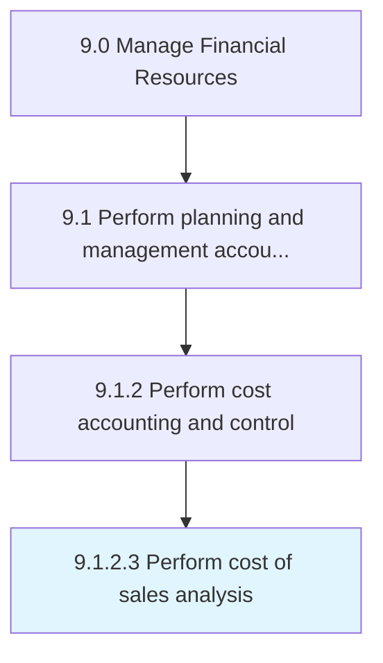

# Perform cost of sales analysis

> Studying expenses directly associated with product.

## Overview

Activity 9.1.2.3 is an activity within the Manage Financial Resources framework. 

Studying expenses directly associated with product. Analyze the cost of sales, which is the cost of manufacturing products.

## Process Hierarchy



## Key Statistics

| Metric | Value |
|--------|-------|
| APQC Code | 10775 |
| Hierarchy ID | 9.1.2.3 |
| Level | Activity |
| Parent | [9.1.2](../) |
| Sub-Processes | 0 |


## GraphDL Semantic Structure

```
perform.Cost.of.SalesAnalysis
```

| Component | Value | Description |
|-----------|-------|-------------|
| Verb | `perform` | Primary action |
| Object | `cost` | Direct object |
| Preposition | `of` | Relationship |
| PrepObject | `sales analysis` | Indirect object |


## Related Concepts

- [Cost](/concepts/Cost)
- [SalesAnalysis](/concepts/SalesAnalysis)


---

*Source: APQC PCF 10775 (9.1.2.3) - APQC*
