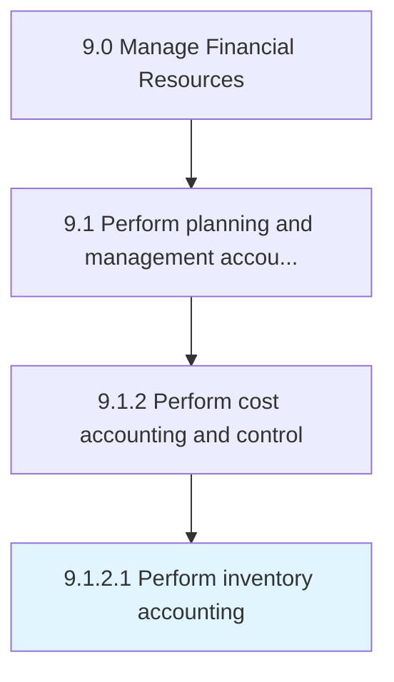

# Perform inventory accounting

> Conducting accounting for assets, and finding reasons for changes (depreciation, obsolescence, deterioration, change in customer taste, increased demand, decreased market supply, etc.

## Overview

Activity 9.1.2.1 is an activity within the Manage Financial Resources framework. 

Conducting accounting for assets, and finding reasons for changes (depreciation, obsolescence, deterioration, change in customer taste, increased demand, decreased market supply, etc.).

## Process Hierarchy



## Key Statistics

| Metric | Value |
|--------|-------|
| APQC Code | 10774 |
| Hierarchy ID | 9.1.2.1 |
| Level | Activity |
| Parent | [9.1.2](../) |
| Sub-Processes | 0 |


## GraphDL Semantic Structure

```
perform.InventoryAccounting
```

| Component | Value | Description |
|-----------|-------|-------------|
| Verb | `perform` | Primary action |
| Object | `inventory accounting` | Direct object |


## Related Concepts

- [InventoryAccounting](/concepts/InventoryAccounting)


---

*Source: APQC PCF 10774 (9.1.2.1) - APQC*
