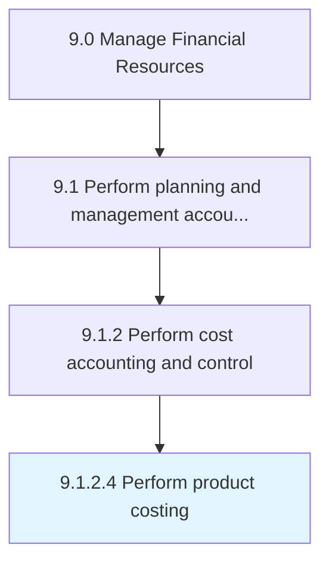

# Perform product costing

> Studying and finding out the relevant cost center for a product by studying every resource used in its making.

## Overview

Activity 9.1.2.4 is an activity within the Manage Financial Resources framework. 

Studying and finding out the relevant cost center for a product by studying every resource used in its making.

## Process Hierarchy



## Key Statistics

| Metric | Value |
|--------|-------|
| APQC Code | 10776 |
| Hierarchy ID | 9.1.2.4 |
| Level | Activity |
| Parent | [9.1.2](../) |
| Sub-Processes | 0 |


## GraphDL Semantic Structure

```
perform.ProductCosting
```

| Component | Value | Description |
|-----------|-------|-------------|
| Verb | `perform` | Primary action |
| Object | `product costing` | Direct object |


## Related Concepts

- ProductCosting


---

*Source: APQC PCF 10776 (9.1.2.4) - APQC*
