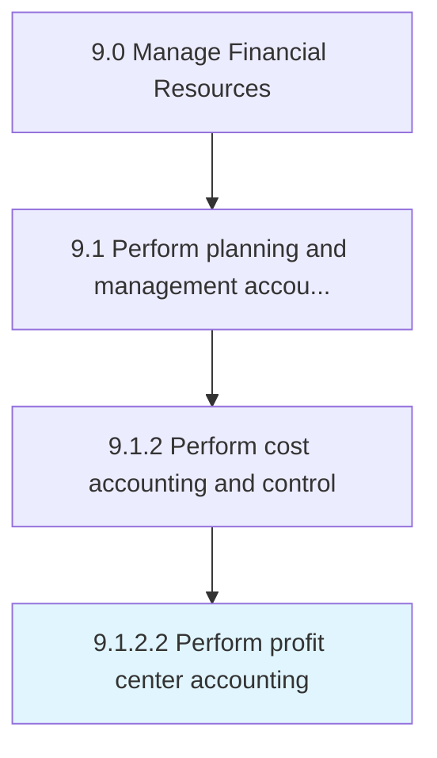

# Perform profit center accounting

> Determining the revenue, profits, and losses incurred by each unit within the organization that produces profit.

## Overview

Activity 9.1.2.2 is an activity within the Manage Financial Resources framework. 

Determining the revenue, profits, and losses incurred by each unit within the organization that produces profit.

## Process Hierarchy



## Key Statistics

| Metric | Value |
|--------|-------|
| APQC Code | 14057 |
| Hierarchy ID | 9.1.2.2 |
| Level | Activity |
| Parent | [9.1.2](../) |
| Sub-Processes | 0 |


## GraphDL Semantic Structure

```
perform.ProfitCenterAccounting
```

| Component | Value | Description |
|-----------|-------|-------------|
| Verb | `perform` | Primary action |
| Object | `profit center accounting` | Direct object |


## Related Concepts

- ProfitCenterAccounting


---

*Source: APQC PCF 14057 (9.1.2.2) - APQC*
