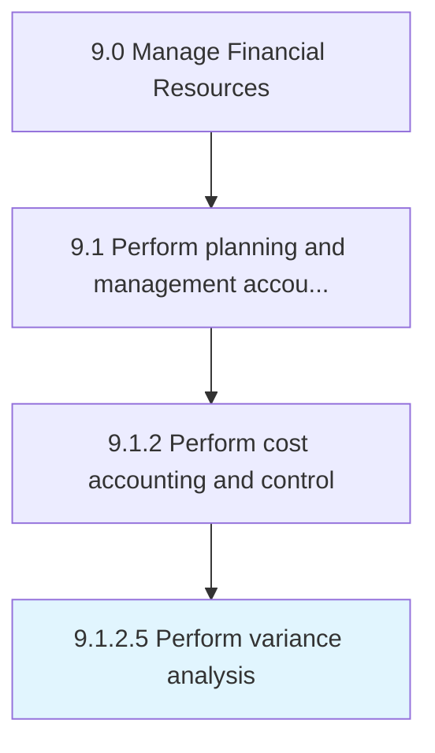

# Perform variance analysis

> Discovering the changes between forecasted and actual costing.

## Overview

Activity 9.1.2.5 is an activity within the Manage Financial Resources framework. 

Discovering the changes between forecasted and actual costing. Analyze actual and planned behavior by reviewing the amount of a variance on a trend line in order to maintain control over a business.

## Process Hierarchy



## Key Statistics

| Metric | Value |
|--------|-------|
| APQC Code | 10777 |
| Hierarchy ID | 9.1.2.5 |
| Level | Activity |
| Parent | [9.1.2](../) |
| Sub-Processes | 0 |


## GraphDL Semantic Structure

```
perform.VarianceAnalysis
```

| Component | Value | Description |
|-----------|-------|-------------|
| Verb | `perform` | Primary action |
| Object | `variance analysis` | Direct object |


## Related Concepts

- VarianceAnalysis


---

*Source: APQC PCF 10777 (9.1.2.5) - APQC*
