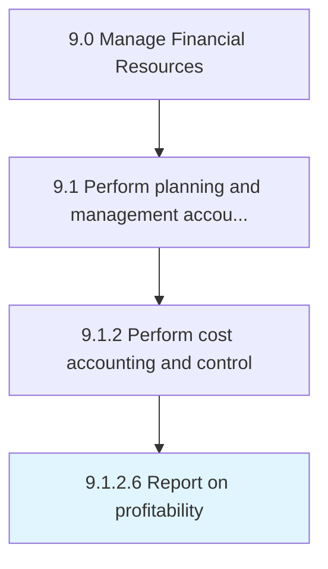

# Report on profitability

> Making a report about revenues generated by the organization or business unit concerned.

## Overview

Activity 9.1.2.6 is an activity within the Manage Financial Resources framework. 

Making a report about revenues generated by the organization or business unit concerned. This process requires the organization to create a report which shows how business is generating profits. Profits are the part which is left after paying all expenses directly related to the generation of the revenue, such as producing a product, and other expenses related to conducting business activities.

## Process Hierarchy



## Key Statistics

| Metric | Value |
|--------|-------|
| APQC Code | 11175 |
| Hierarchy ID | 9.1.2.6 |
| Level | Activity |
| Parent | [9.1.2](../) |
| Sub-Processes | 0 |


## GraphDL Semantic Structure

```
report.OnProfitability
```

| Component | Value | Description |
|-----------|-------|-------------|
| Verb | `report` | Primary action |
| Object | `on profitability` | Direct object |


## Related Concepts

- Profitability


---

*Source: APQC PCF 11175 (9.1.2.6) - APQC*
