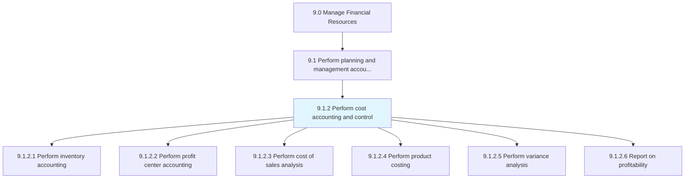
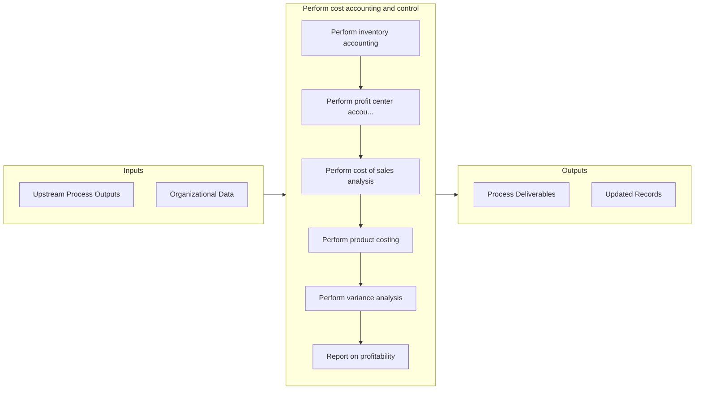

# Perform cost accounting and control

> Defining costs to be incurred and methods for optimum utilization.

## Overview

Process 9.1.2 is a core process that defines the specific procedures for perform cost accounting and control. 

Defining costs to be incurred and methods for optimum utilization. Determine the costs of products, processes, projects, etc. to compile in the financial statements, as well as to assist management in making decisions regarding planning and control. Control costs by managing and reducing business expenses.

## Process Hierarchy



## Key Statistics

| Metric | Value |
|--------|-------|
| APQC Code | 10739 |
| Hierarchy ID | 9.1.2 |
| Level | Process |
| Parent | [9.1](../) |
| Sub-Processes | 6 |


## GraphDL Semantic Structure

```graphdl
perform.CostAccountingAndControl
```

| Component | Value | Description |
|-----------|-------|-------------|
| Verb | `perform` | Primary action |
| Object | `cost accounting and control` | Direct object |


## Process Flow



## Sub-Processes

| Process | Hierarchy ID | Description |
|---------|-------------|-------------|
| [Perform inventory accounting](./PerformInventoryAccounting) | 9.1.2.1 | Conducting accounting for assets, and finding reasons for changes (depreciation, obsolescence, deter |
| [Perform profit center accounting](./PerformProfitCenterAccounting) | 9.1.2.2 | Determining the revenue, profits, and losses incurred by each unit within the organization that prod |
| [Perform cost of sales analysis](./PerformCostOfSalesAnalysis) | 9.1.2.3 | Studying expenses directly associated with product |
| [Perform product costing](./PerformProductCosting) | 9.1.2.4 | Studying and finding out the relevant cost center for a product by studying every resource used in i |
| [Perform variance analysis](./PerformVarianceAnalysis) | 9.1.2.5 | Discovering the changes between forecasted and actual costing |
| [Report on profitability](./ReportOnProfitability) | 9.1.2.6 | Making a report about revenues generated by the organization or business unit concerned |


## Related Concepts

- CostAccounting
- Control


---

*Source: APQC PCF 10739 (9.1.2) - APQC*
