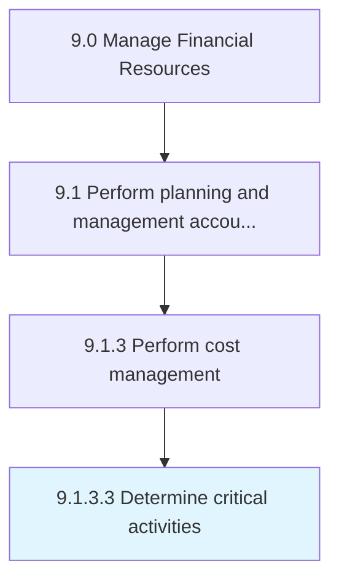

# Determine critical activities

> Determine the activities that hinder the progress of finance activities.

## Overview

Activity 9.1.3.3 is an activity within the Manage Financial Resources framework. 

Determine the activities that hinder the progress of finance activities. This requires the organization to determine those business activities carried out by the financial function of the organization and which are indispensable. This undertaking helps the organization triangulate those activities which are essential and where costs cannot be slashed.

## Process Hierarchy



## Key Statistics

| Metric | Value |
|--------|-------|
| APQC Code | 10780 |
| Hierarchy ID | 9.1.3.3 |
| Level | Activity |
| Parent | [9.1.3](../) |
| Sub-Processes | 0 |


## GraphDL Semantic Structure

```
determine.CriticalActivities
```

| Component | Value | Description |
|-----------|-------|-------------|
| Verb | `determine` | Primary action |
| Object | `critical activities` | Direct object |


## Related Concepts

- CriticalActivities


---

*Source: APQC PCF 10780 (9.1.3.3) - APQC*
