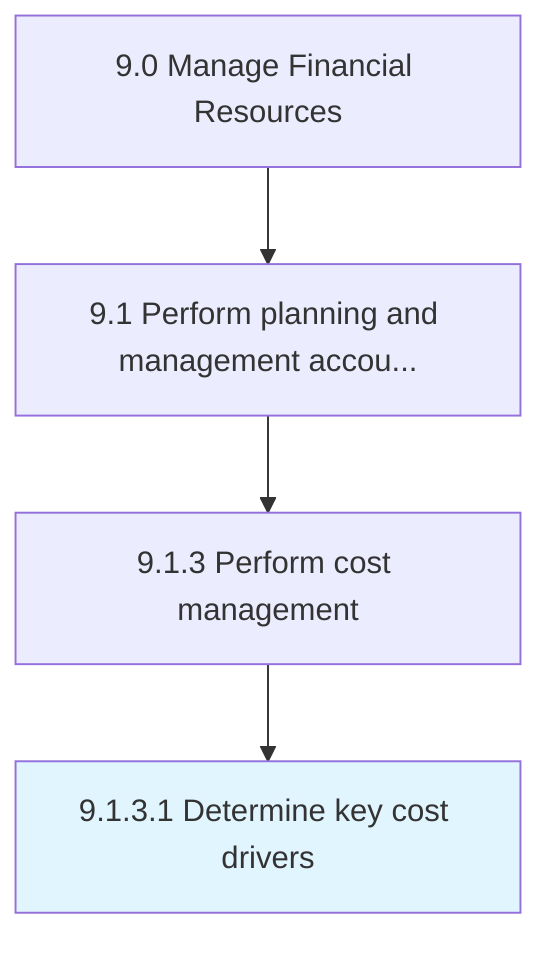

# Determine key cost drivers

> Defining cost drivers for a particular activity.

## Overview

Activity 9.1.3.1 is an activity within the Manage Financial Resources framework. 

## Process Hierarchy



## Key Statistics

| Metric | Value |
|--------|-------|
| APQC Code | 10778 |
| Hierarchy ID | 9.1.3.1 |
| Level | Activity |
| Parent | [9.1.3](../) |
| Sub-Processes | 0 |


## GraphDL Semantic Structure

```
determine.KeyCostDrivers
```

| Component | Value | Description |
|-----------|-------|-------------|
| Verb | `determine` | Primary action |
| Object | `key cost drivers` | Direct object |


## Related Concepts

- [KeyCostDrivers](/concepts/KeyCostDrivers)


---

*Source: APQC PCF 10778 (9.1.3.1) - APQC*
