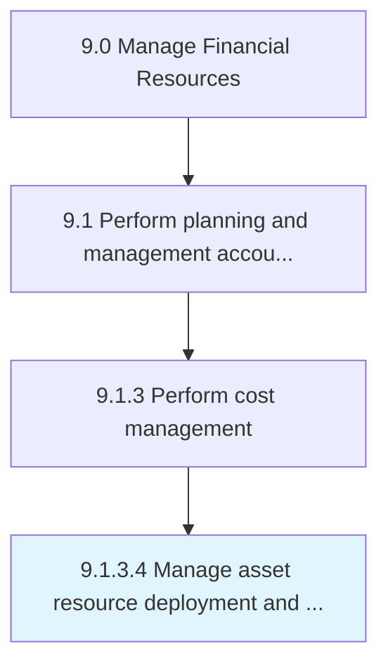

# Manage asset resource deployment and utilization

> Distributing or allocating asset resources in different processes for optimal utilization.

## Overview

Activity 9.1.3.4 is an activity within the Manage Financial Resources framework. 

Distributing or allocating asset resources in different processes for optimal utilization.

## Process Hierarchy



## Key Statistics

| Metric | Value |
|--------|-------|
| APQC Code | 10781 |
| Hierarchy ID | 9.1.3.4 |
| Level | Activity |
| Parent | [9.1.3](../) |
| Sub-Processes | 0 |


## GraphDL Semantic Structure

```
manage.AssetResourceDeploymentAndUtilization
```

| Component | Value | Description |
|-----------|-------|-------------|
| Verb | `manage` | Primary action |
| Object | `asset resource deployment and utilization` | Direct object |


## Related Concepts

- AssetResourceDeployment
- Utilization


---

*Source: APQC PCF 10781 (9.1.3.4) - APQC*
