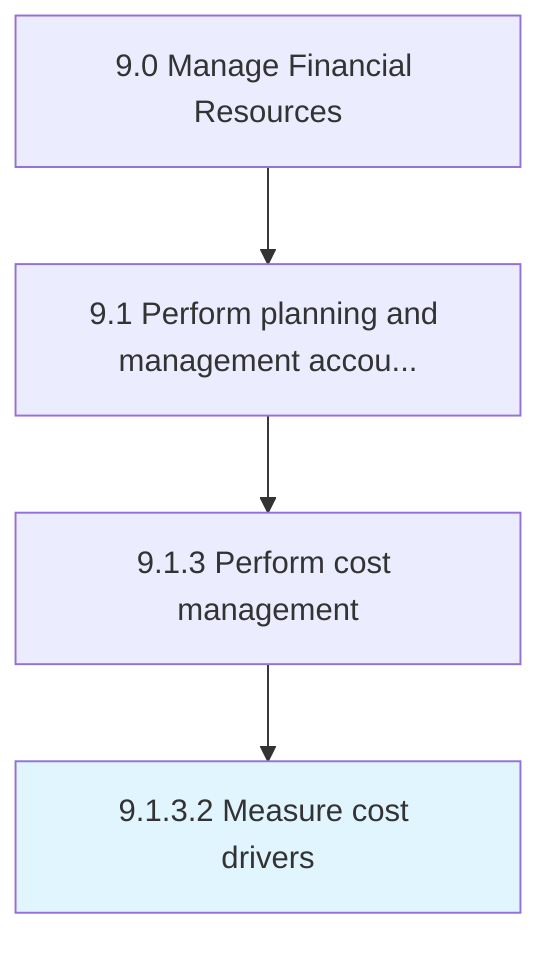

# Measure cost drivers

> Calculating cost drivers.

## Overview

Activity 9.1.3.2 is an activity within the Manage Financial Resources framework. 

## Process Hierarchy



## Key Statistics

| Metric | Value |
|--------|-------|
| APQC Code | 10779 |
| Hierarchy ID | 9.1.3.2 |
| Level | Activity |
| Parent | [9.1.3](../) |
| Sub-Processes | 0 |


## GraphDL Semantic Structure

```
measure.CostDrivers
```

| Component | Value | Description |
|-----------|-------|-------------|
| Verb | `measure` | Primary action |
| Object | `cost drivers` | Direct object |


## Related Concepts

- [CostDrivers](/concepts/CostDrivers)


---

*Source: APQC PCF 10779 (9.1.3.2) - APQC*
