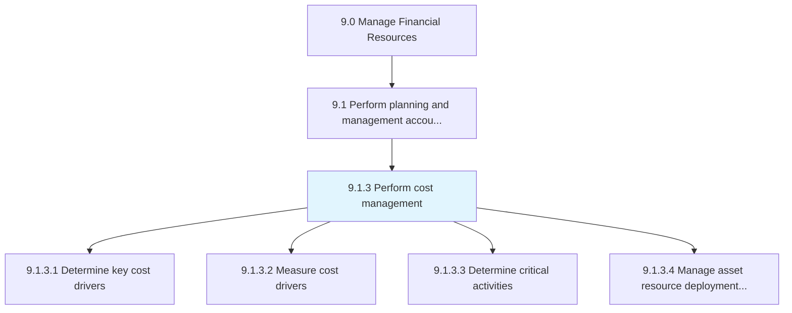
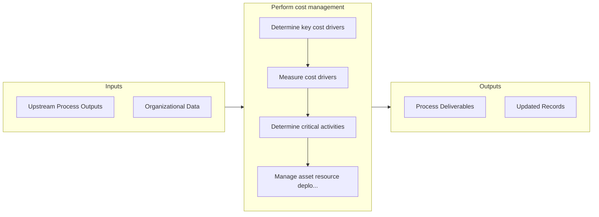

# Perform cost management

> Deciding which expenses can be avoided to reduce some costs and increase revenues.

## Overview

Process 9.1.3 is a core process that defines the specific procedures for perform cost management. 

Deciding which expenses can be avoided to reduce some costs and increase revenues. Plan and control the organization's budget to forecast future expenditures.

## Process Hierarchy



## Key Statistics

| Metric | Value |
|--------|-------|
| APQC Code | 10740 |
| Hierarchy ID | 9.1.3 |
| Level | Process |
| Parent | [9.1](../) |
| Sub-Processes | 4 |


## GraphDL Semantic Structure

```
perform.CostManagement
```

| Component | Value | Description |
|-----------|-------|-------------|
| Verb | `perform` | Primary action |
| Object | `cost management` | Direct object |


## Process Flow



## Sub-Processes

| Process | Hierarchy ID | Description |
|---------|-------------|-------------|
| [Determine key cost drivers](./DetermineKeyCostDrivers) | 9.1.3.1 | Defining cost drivers for a particular activity |
| [Measure cost drivers](./MeasureCostDrivers) | 9.1.3.2 | Calculating cost drivers |
| [Determine critical activities](./DetermineCriticalActivities) | 9.1.3.3 | Determine the activities that hinder the progress of finance activities |
| [Manage asset resource deployment and utilization](./ManageAssetResourceDeploymentAndUtilization) | 9.1.3.4 | Distributing or allocating asset resources in different processes for optimal utilization |


## Related Concepts

- CostManagement


---

*Source: APQC PCF 10740 (9.1.3) - APQC*
