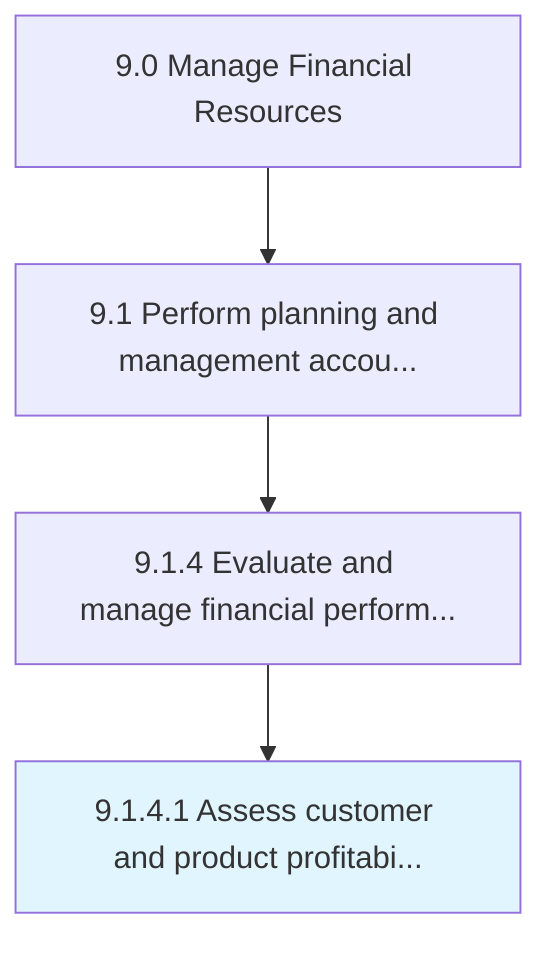

# Assess customer and product profitability

> Studying product demand and targeted customer preferences.

## Overview

Activity 9.1.4.1 is an activity within the Manage Financial Resources framework. 

Studying product demand and targeted customer preferences. Study customers' demands or preferences after deducting the cost of delivering the final product.

## Process Hierarchy



## Key Statistics

| Metric | Value |
|--------|-------|
| APQC Code | 10782 |
| Hierarchy ID | 9.1.4.1 |
| Level | Activity |
| Parent | [9.1.4](../) |
| Sub-Processes | 0 |


## GraphDL Semantic Structure

```
assess.CustomerAndProductProfitability
```

| Component | Value | Description |
|-----------|-------|-------------|
| Verb | `assess` | Primary action |
| Object | `customer and product profitability` | Direct object |


## Related Concepts

- [CustomerProfitability](/concepts/CustomerProfitability)
- [ProductProfitability](/concepts/ProductProfitability)


---

*Source: APQC PCF 10782 (9.1.4.1) - APQC*
