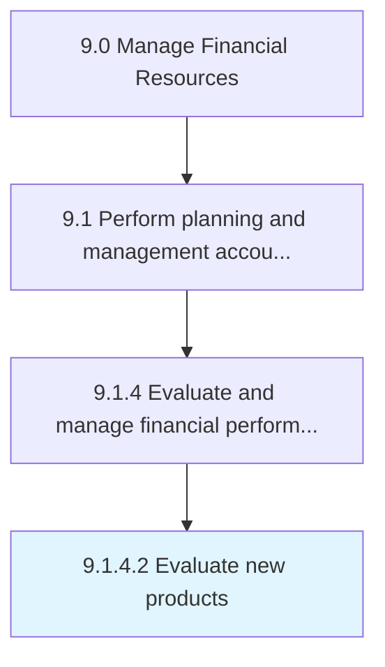

# Evaluate new products

> Checking demand about a specific product by a customer segment.

## Overview

Activity 9.1.4.2 is an activity within the Manage Financial Resources framework. 

Checking demand about a specific product by a customer segment. Conduct a detailed study--or research a customer behavior or preference for a product--in order to determine its production and profitability in a specific market.

## Process Hierarchy



## Key Statistics

| Metric | Value |
|--------|-------|
| APQC Code | 10783 |
| Hierarchy ID | 9.1.4.2 |
| Level | Activity |
| Parent | [9.1.4](../) |
| Sub-Processes | 0 |


## GraphDL Semantic Structure

```
evaluate.NewProducts
```

| Component | Value | Description |
|-----------|-------|-------------|
| Verb | `evaluate` | Primary action |
| Object | `new products` | Direct object |


## Related Concepts

- [NewProducts](/concepts/NewProducts)


---

*Source: APQC PCF 10783 (9.1.4.2) - APQC*
