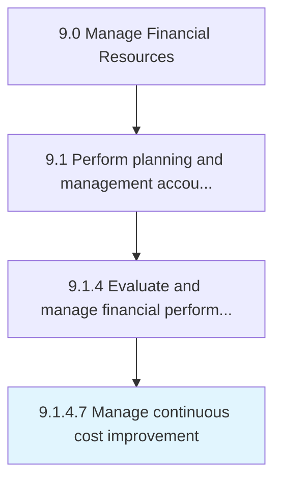
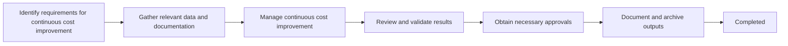
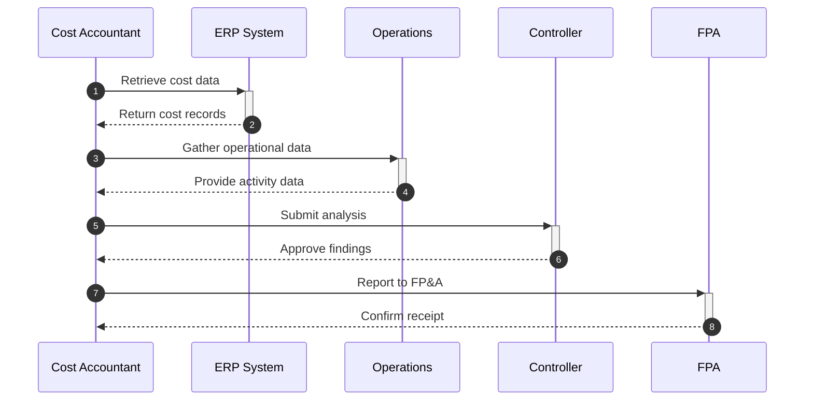

# Manage continuous cost improvement

> Conducting activities to improve cost distribution regularly.

## Overview

Activity 9.1.4.7 is an activity within the Planning & Management Accounting domain of the Manage Financial Resources framework.

Conducting activities to improve cost distribution regularly. This activity plays a critical role in ensuring that the organization maintains sound financial governance, operational efficiency, and regulatory compliance. It supports upstream planning and downstream execution by providing structured outputs that inform decision-making across finance and business operations. Effective execution of this activity requires coordination among finance professionals, process owners, and leadership stakeholders to ensure accuracy, timeliness, and alignment with organizational objectives.

## Process Hierarchy



## Process Flow



## Key Statistics

| Metric | Value |
|--------|-------|
| APQC Code | 10788 |
| Hierarchy ID | 9.1.4.7 |
| Level | Activity |
| Parent | [9.1.4](../) |
| Sub-Processes | 0 |

## GraphDL Semantic Structure

```graphdl
manage.ContinuousCostImprovement
```

| Component | Value | Description |
|-----------|-------|-------------|
| Verb | `manage` | Primary action |
| Object | `continuous cost improvement` | Direct object |

## RACI Matrix

| Activity | Responsible | Accountable | Consulted | Informed |
|----------|-------------|-------------|-----------|----------|
| Prepare budgets/forecasts | FP&A Analyst | FP&A Director | Department Heads | CFO |
| Review and approve | FP&A Director | CFO | Controller | Executive Team |
| Monitor variance | FP&A Analyst | FP&A Director | Budget Owners | Finance Leadership |

## Related Occupations

- [Financial Managers](/occupations/Management/FinancialManagers)
- [Accountants and Auditors](/occupations/Business/Financial/AccountantsAndAuditors)
- [Budget Analysts](/occupations/Business/Financial/BudgetAnalysts)
- [Management Analysts](/occupations/Business/Operations/ManagementAnalysts)
- [Cost Estimators](/occupations/Business/CostEstimators)

## Related Departments

- Finance & Accounting
- FP&A (Financial Planning & Analysis)
- Executive Management

## Industry Variations

### Banking

Incorporates regulatory capital planning, stress testing scenarios, and Basel III compliance requirements into budgeting and forecasting cycles.

### Healthcare

Budgeting integrates patient volume forecasts, reimbursement rate changes, and capital equipment planning with clinical department input.

### Manufacturing

Planning accounts for raw material cost volatility, production capacity constraints, and seasonal demand patterns.

## KPIs & Metrics

| Metric | Description | Target |
|--------|-------------|--------|
| Budget Variance % | Deviation of actuals from budgeted amounts | < 5% |
| Forecast Accuracy | Accuracy of financial forecasts vs. actuals | > 95% |
| Planning Cycle Time | Days to complete annual budgeting cycle | < 45 days |
| Cost per Budget FTE | Cost of planning function per finance FTE | Industry benchmark |

## Process Sequence



## Related Concepts

- ContinuousCostImprovement

---

*Source: APQC PCF 10788 (9.1.4.7) - APQC*