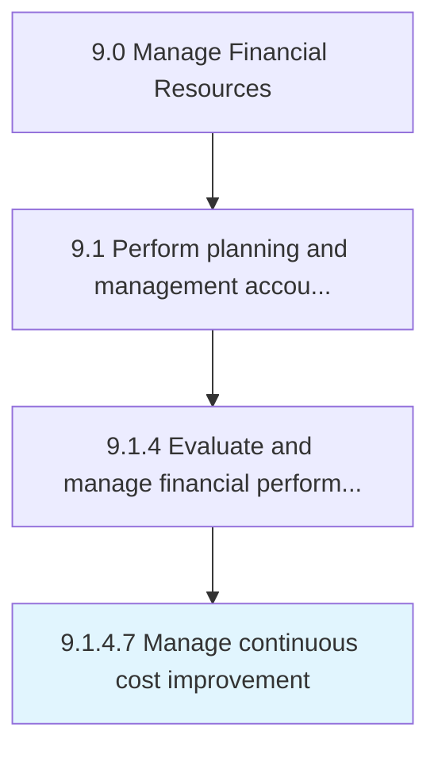

# Manage continuous cost improvement

> Conducting activities to improve cost distribution regularly.

## Overview

Activity 9.1.4.7 is an activity within the Manage Financial Resources framework. 

Conducting activities to improve cost distribution regularly. Follow or adopt different ways of reducing costs.

## Process Hierarchy



## Key Statistics

| Metric | Value |
|--------|-------|
| APQC Code | 10788 |
| Hierarchy ID | 9.1.4.7 |
| Level | Activity |
| Parent | [9.1.4](../) |
| Sub-Processes | 0 |


## GraphDL Semantic Structure

```
manage.ContinuousCostImprovement
```

| Component | Value | Description |
|-----------|-------|-------------|
| Verb | `manage` | Primary action |
| Object | `continuous cost improvement` | Direct object |


## Related Concepts

- ContinuousCostImprovement


---

*Source: APQC PCF 10788 (9.1.4.7) - APQC*
