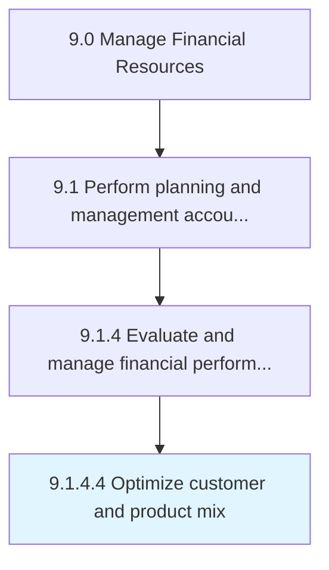

# Optimize customer and product mix

> Creating the best fit between a product and the end user.

## Overview

Activity 9.1.4.4 is an activity within the Manage Financial Resources framework. 

Creating the best fit between a product and the end user. Maximize the customer base by providing different products in the market.

## Process Hierarchy



## Key Statistics

| Metric | Value |
|--------|-------|
| APQC Code | 10785 |
| Hierarchy ID | 9.1.4.4 |
| Level | Activity |
| Parent | [9.1.4](../) |
| Sub-Processes | 0 |


## GraphDL Semantic Structure

```
optimize.CustomerAndProductMix
```

| Component | Value | Description |
|-----------|-------|-------------|
| Verb | `optimize` | Primary action |
| Object | `customer and product mix` | Direct object |


## Related Concepts

- CustomerMix
- ProductMix


---

*Source: APQC PCF 10785 (9.1.4.4) - APQC*
