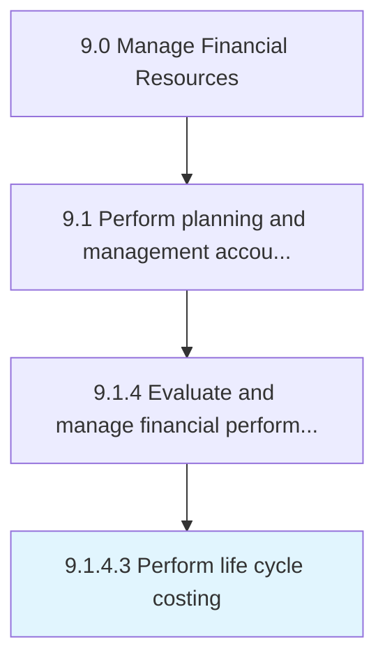

# Perform life cycle costing

> Determining the cost of delivering an end product at different stages of production.

## Overview

Activity 9.1.4.3 is an activity within the Manage Financial Resources framework. 

Determining the cost of delivering an end product at different stages of production. Study the total life cycle of a product/process to determine how much revenue and production cost will be incurred at every stage in order to make strategic decisions.

## Process Hierarchy



## Key Statistics

| Metric | Value |
|--------|-------|
| APQC Code | 10784 |
| Hierarchy ID | 9.1.4.3 |
| Level | Activity |
| Parent | [9.1.4](../) |
| Sub-Processes | 0 |


## GraphDL Semantic Structure

```
perform.LifeCycleCosting
```

| Component | Value | Description |
|-----------|-------|-------------|
| Verb | `perform` | Primary action |
| Object | `life cycle costing` | Direct object |


## Related Concepts

- LifeCycleCosting


---

*Source: APQC PCF 10784 (9.1.4.3) - APQC*
