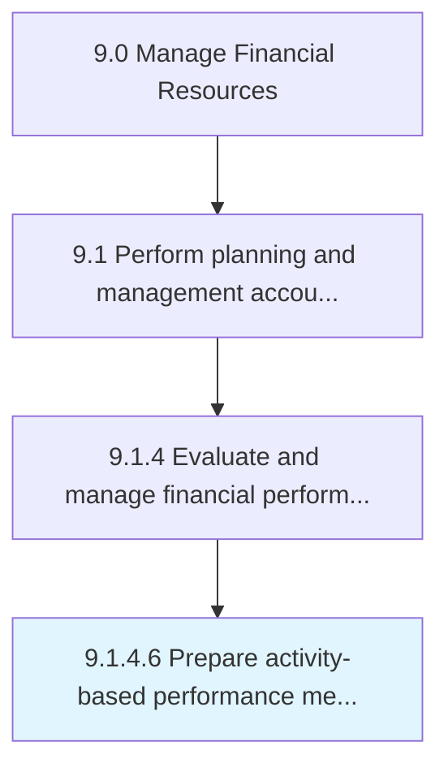

# Prepare activity-based performance measures

> Evaluating performance based on different sets of activities created by management to measure performance.

## Overview

Activity 9.1.4.6 is an activity within the Manage Financial Resources framework. 

Evaluating performance based on different sets of activities created by management to measure performance.

## Process Hierarchy



## Key Statistics

| Metric | Value |
|--------|-------|
| APQC Code | 10787 |
| Hierarchy ID | 9.1.4.6 |
| Level | Activity |
| Parent | [9.1.4](../) |
| Sub-Processes | 0 |


## GraphDL Semantic Structure

```
prepare.ActivitybasedPerformanceMeasures
```

| Component | Value | Description |
|-----------|-------|-------------|
| Verb | `prepare` | Primary action |
| Object | `activity-based performance measures` | Direct object |


---

*Source: APQC PCF 10787 (9.1.4.6) - APQC*
