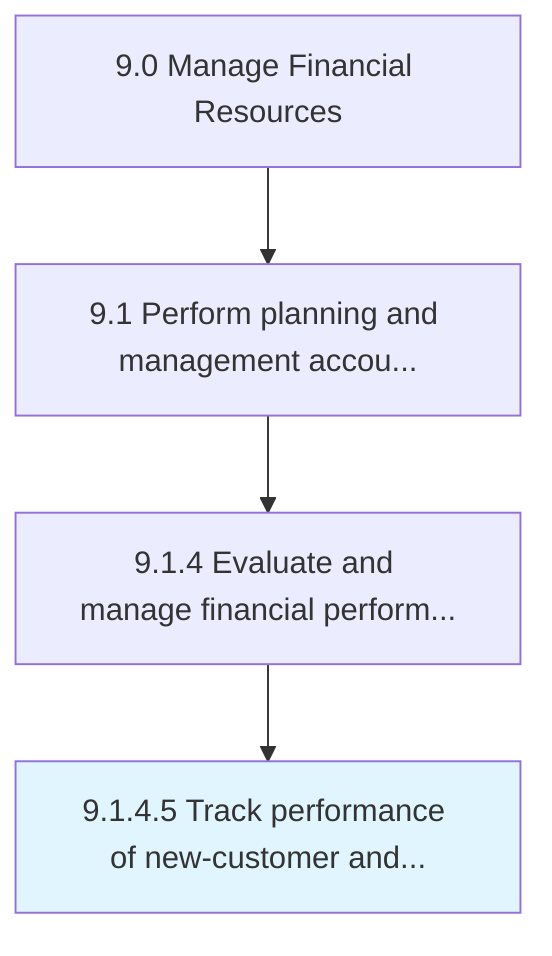

# Track performance of new-customer and product strategies

> Observing the behavior of a new set of customers for different products.

## Overview

Activity 9.1.4.5 is an activity within the Manage Financial Resources framework. 

Observing the behavior of a new set of customers for different products. Prepare strategies to improve sales and profits.

## Process Hierarchy



## Key Statistics

| Metric | Value |
|--------|-------|
| APQC Code | 10786 |
| Hierarchy ID | 9.1.4.5 |
| Level | Activity |
| Parent | [9.1.4](../) |
| Sub-Processes | 0 |


## GraphDL Semantic Structure

```
track.Performance.of.NewcustomerAndProductStrategies
```

| Component | Value | Description |
|-----------|-------|-------------|
| Verb | `track` | Primary action |
| Object | `performance` | Direct object |
| Preposition | `of` | Relationship |
| PrepObject | `new-customer and product strategies` | Indirect object |


---

*Source: APQC PCF 10786 (9.1.4.5) - APQC*
