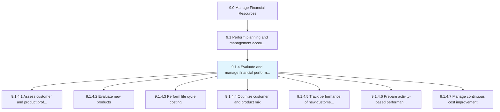
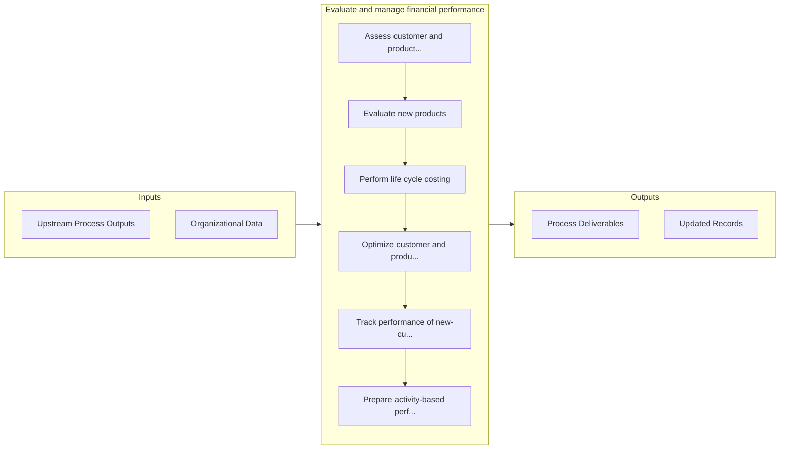

# Evaluate and manage financial performance

> Checking and achieving predetermined financial targets and timelines.

## Overview

Process 9.1.4 is a core process that defines the specific procedures for evaluate and manage financial performance. 

Checking and achieving predetermined financial targets and timelines. Assess and manage the profitability, feasibility, and consistency of a business or project. Study the revenues generated.

## Process Hierarchy



## Key Statistics

| Metric | Value |
|--------|-------|
| APQC Code | 10741 |
| Hierarchy ID | 9.1.4 |
| Level | Process |
| Parent | [9.1](../) |
| Sub-Processes | 7 |


## GraphDL Semantic Structure

```graphdl
evaluate.AndManageFinancialPerformance
```

| Component | Value | Description |
|-----------|-------|-------------|
| Verb | `evaluate` | Primary action |
| Object | `and manage financial performance` | Direct object |


## Process Flow



## Sub-Processes

| Process | Hierarchy ID | Description |
|---------|-------------|-------------|
| [Assess customer and product profitability](./AssessCustomerAndProductProfitability) | 9.1.4.1 | Studying product demand and targeted customer preferences |
| [Evaluate new products](./EvaluateNewProducts) | 9.1.4.2 | Checking demand about a specific product by a customer segment |
| [Perform life cycle costing](./PerformLifeCycleCosting) | 9.1.4.3 | Determining the cost of delivering an end product at different stages of production |
| [Optimize customer and product mix](./OptimizeCustomerAndProductMix) | 9.1.4.4 | Creating the best fit between a product and the end user |
| [Track performance of new-customer and product strategies](./TrackPerformanceOfNewcustomerAndProductStrategies) | 9.1.4.5 | Observing the behavior of a new set of customers for different products |
| [Prepare activity-based performance measures](./PrepareActivitybasedPerformanceMeasures) | 9.1.4.6 | Evaluating performance based on different sets of activities created by management to measure perfor |
| [Manage continuous cost improvement](./ManageContinuousCostImprovement) | 9.1.4.7 | Conducting activities to improve cost distribution regularly |


## Related Concepts

- FinancialPerformance
- FinancialPerformance


---

*Source: APQC PCF 10741 (9.1.4) - APQC*
