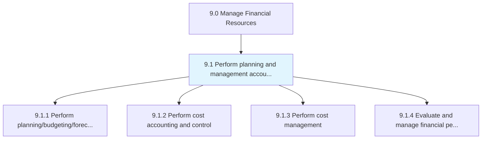
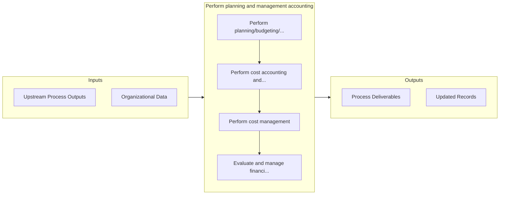

# Perform planning and management accounting

> Determining different stages of the planning process and accounting.

## Overview

Group 9.1 is a process group within APQC Category 9.0 (Manage Financial Resources). 

Determining different stages of the planning process and accounting. Classify, determine, analyze, interpret, and communicate information to make up-to-date business decisions for better management and control functions.

## Process Hierarchy



## Key Statistics

| Metric | Value |
|--------|-------|
| APQC Code | 10728 |
| Hierarchy ID | 9.1 |
| Level | Group |
| Parent | [9](../) |
| Sub-Processes | 4 |


## GraphDL Semantic Structure

```
perform.PlanningAndManagementAccounting
```

| Component | Value | Description |
|-----------|-------|-------------|
| Verb | `perform` | Primary action |
| Object | `planning and management accounting` | Direct object |


## Process Flow



## Sub-Processes

| Process | Hierarchy ID | Description |
|---------|-------------|-------------|
| [Perform planning/budgeting/forecasting](./9.1.1-PerformPlanningbudgetingforecasting/) | 9.1.1 | Allocating funds to meet future and current financial goals |
| [Perform cost accounting and control](./9.1.2-PerformCostAccountingControl/) | 9.1.2 | Defining costs to be incurred and methods for optimum utilization |
| [Perform cost management](./9.1.3-PerformCostManagement/) | 9.1.3 | Deciding which expenses can be avoided to reduce some costs and increase revenues |
| [Evaluate and manage financial performance](./9.1.4-EvaluateManageFinancialPerformance/) | 9.1.4 | Checking and achieving predetermined financial targets and timelines |


## Related Concepts

- [Planning](/concepts/Planning)
- [ManagementAccounting](/concepts/ManagementAccounting)


---

*Source: APQC PCF 10728 (9.1) - APQC*
