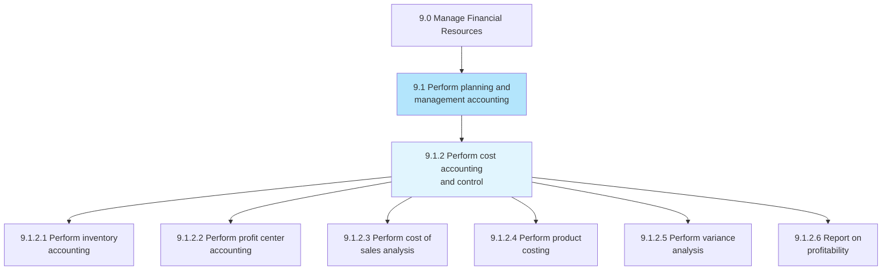
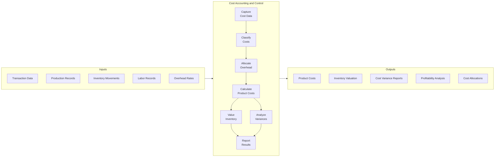
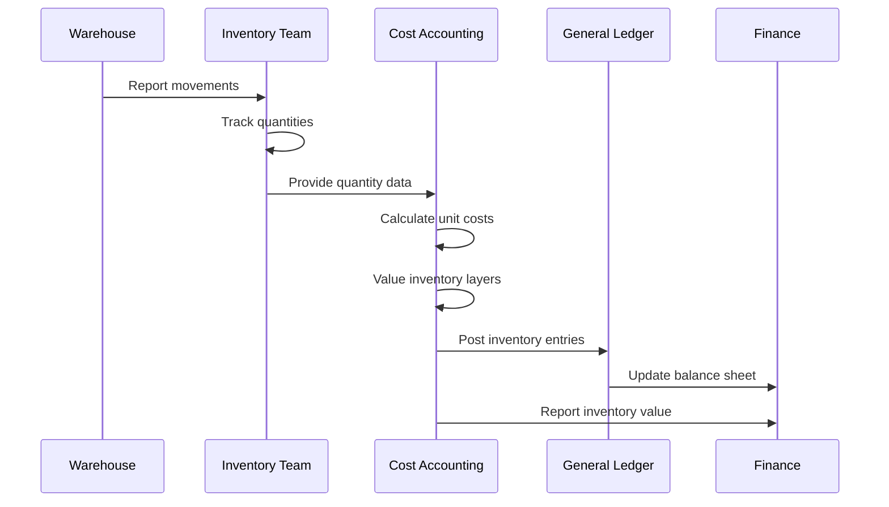
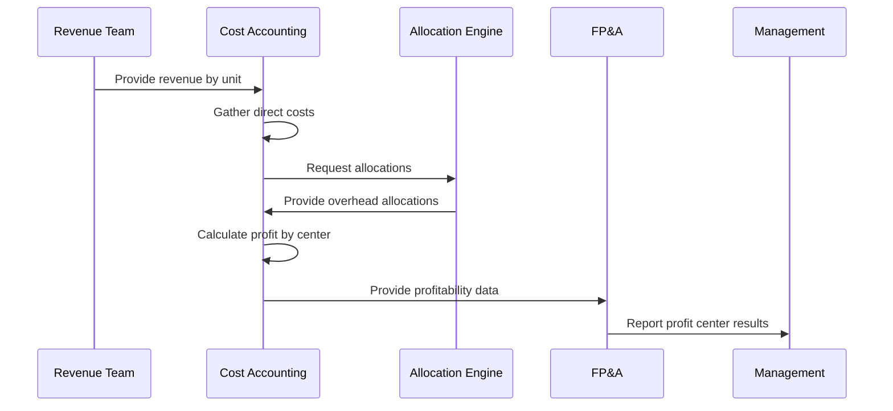
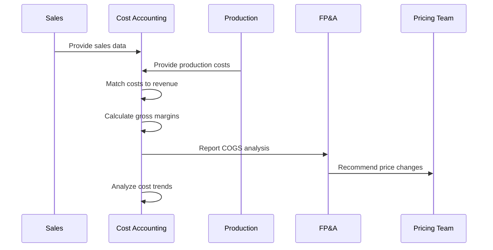
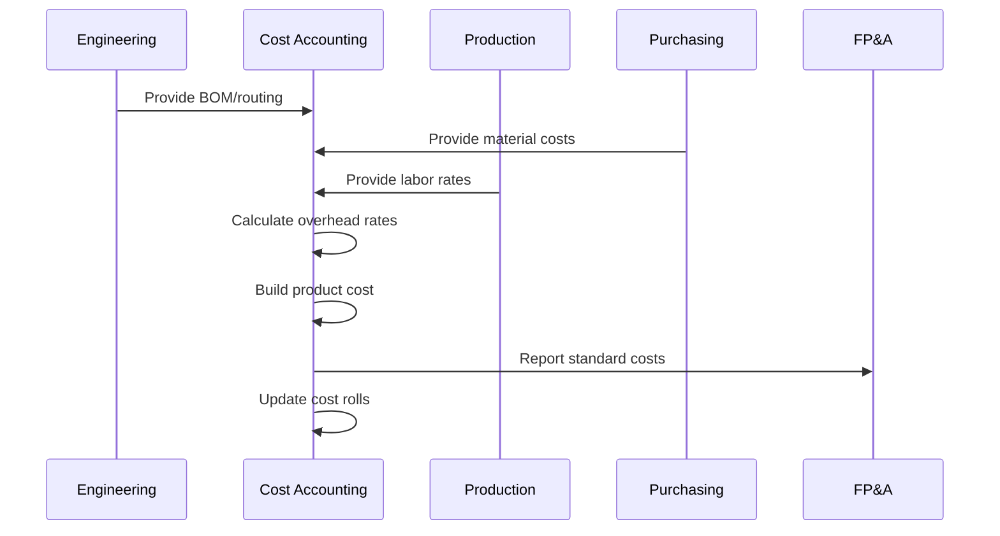
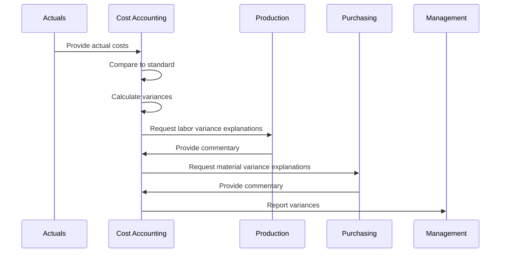
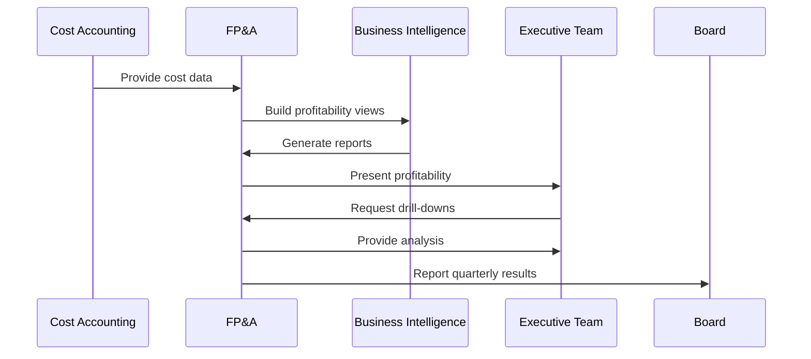

# Perform Cost Accounting and Control

*APQC Process 9.1.2*

> Defining costs to be incurred and methods for optimum utilization. Determine the costs of products, processes, projects, etc. to compile in the financial statements, as well as to assist management in making decisions regarding planning and control.

## Overview

Perform Cost Accounting and Control is a critical process for understanding and managing organizational costs. This process tracks, allocates, and analyzes costs to support pricing decisions, profitability analysis, and operational efficiency. Cost accounting provides the foundation for inventory valuation, product costing, and management reporting.

## Process Hierarchy



## Key Statistics

| Metric | Value |
|--------|-------|
| APQC Code | 10739 |
| Hierarchy ID | 9.1.2 |
| Level | Process |
| Category | [Manage Financial Resources](/processes/09-Finance) |
| Process Group | [Perform Planning and Management Accounting](./index) |
| Activities | 6 |

## Process Flow



## GraphDL Semantic Structure

```graphdl
perform.CostAccountingAndControl
```

| Component | Value | Description |
|-----------|-------|-------------|
| Verb | `perform` | Execute or carry out |
| Object | `CostAccountingAndControl` | Cost tracking and management |
| Preposition | - | Not applicable |
| PrepObject | - | Not applicable |

### Semantic Decomposition

| Sub-Task | GraphDL Notation |
|----------|------------------|
| Perform inventory accounting | `perform.InventoryAccounting` |
| Perform profit center accounting | `perform.ProfitCenterAccounting` |
| Perform cost of sales analysis | `perform.CostOfSalesAnalysis` |
| Perform product costing | `perform.ProductCosting` |

## Activities

### 9.1.2.1 - Perform inventory accounting

Conducting accounting for assets, and finding reasons for changes (depreciation, obsolescence, deterioration, change in customer taste, increased demand, decreased market supply, etc.).



**Tasks:**
- `track.InventoryMovements` - Record receipts and issues
- `calculate.InventoryCost.using.CostingMethod` - Apply FIFO/LIFO/Average
- `value.InventoryLayers` - Determine period-end value
- `analyze.InventoryObsolescence` - Identify slow-moving items

### 9.1.2.2 - Perform profit center accounting

Determining the revenue, profits, and losses incurred by each unit within the organization that produces profit.



**Tasks:**
- `define.ProfitCenters` - Establish organizational units
- `assign.RevenuesAndCosts.to.ProfitCenters` - Direct attribution
- `allocate.SharedCosts.to.ProfitCenters` - Overhead distribution
- `calculate.ProfitCenterMargins` - Compute profitability

### 9.1.2.3 - Perform cost of sales analysis

Studying expenses directly associated with product. Analyze the cost of sales, which is the cost of manufacturing products.



**Tasks:**
- `match.CostsToRevenue` - Apply matching principle
- `calculate.GrossMargin.by.Product` - Determine product profitability
- `analyze.COGSTrends` - Track cost changes over time
- `identify.CostReductionOpportunities` - Find savings

### 9.1.2.4 - Perform product costing

Studying and finding out the relevant cost center for a product by studying every resource used in its making.



**Tasks:**
- `define.BillOfMaterials` - Specify material requirements
- `establish.LaborRouting` - Define labor operations
- `calculate.OverheadRates` - Determine burden rates
- `build.StandardCost.for.Products` - Create cost records

### 9.1.2.5 - Perform variance analysis

Discovering the changes between forecasted and actual costing to maintain control over a business.



**Tasks:**
- `calculate.MaterialVariance` - Price and usage variances
- `calculate.LaborVariance` - Rate and efficiency variances
- `calculate.OverheadVariance` - Spending and volume variances
- `investigate.SignificantVariances` - Root cause analysis

### 9.1.2.6 - Report on profitability

Making a report about revenues generated by the organization or business unit concerned.



**Tasks:**
- `prepare.ProfitabilityReports` - Generate standard reports
- `analyze.MarginTrends` - Track profitability over time
- `report.ProfitabilityByDimension` - Product, customer, channel
- `recommend.ProfitabilityImprovements` - Identify actions

## RACI Matrix

| Activity | Responsible | Accountable | Consulted | Informed |
|----------|-------------|-------------|-----------|----------|
| Perform inventory accounting | Cost Accountants | Controller | Operations, Warehouse | CFO |
| Perform profit center accounting | Cost Accountants | Controller | Business Unit Leaders | FP&A |
| Perform cost of sales analysis | Cost Accountants | Controller | Sales, Operations | Pricing |
| Perform product costing | Cost Accountants | Controller | Engineering, Purchasing | Operations |
| Perform variance analysis | Cost Accountants | Controller | Production, Purchasing | Management |
| Report on profitability | FP&A Analysts | FP&A Director | Cost Accounting | Executive Team |

## Related Departments

- Cost Accounting - Primary process owner
- [Operations](/departments/Operations/index) - Source of operational data
- [Manufacturing](/departments/Operations) - Production cost inputs
- Purchasing - Material cost data

## Related Occupations

- [Cost Estimators](/occupations/Business/CostEstimators) - Cost analysis specialists
- [Accountants](/occupations/Accountants) - General accounting support
- [Financial Analysts](/occupations/Business/Financial/FinancialAnalysts) - Profitability analysis
- [Industrial Engineers](/occupations/Architecture/IndustrialEngineers) - Process efficiency

## Industry Variations

### Manufacturing

Manufacturing cost accounting emphasizes standard costing, work-in-process tracking, and production variances. Activity-based costing allocates overhead based on cost drivers.

**Industry-Specific Activities:**
- Maintain standard cost system
- Track WIP inventory
- Calculate production variances
- Perform activity-based costing

### Healthcare

Healthcare cost accounting focuses on procedure-level costing, case mix analysis, and cost-to-charge ratios for reimbursement.

**Industry-Specific Activities:**
- Calculate procedure costs
- Analyze case mix profitability
- Maintain cost-to-charge ratios
- Support value-based care initiatives

### Construction

Construction cost accounting tracks job costs, manages percentage-of-completion accounting, and controls project budgets.

**Industry-Specific Activities:**
- Track job costs by project
- Apply percentage-of-completion method
- Manage contract change orders
- Forecast project profitability

## Sub-Activities

| Activity | Code | Description |
|----------|------|-------------|
| [Perform inventory accounting](./PerformInventoryAccounting) | 9.1.2.1 | Inventory valuation |
| [Perform profit center accounting](./PerformProfitCenterAccounting) | 9.1.2.2 | Unit profitability |
| [Perform cost of sales analysis](./PerformCostOfSalesAnalysis) | 9.1.2.3 | COGS analysis |
| [Perform product costing](./PerformProductCosting) | 9.1.2.4 | Product cost calculation |
| [Perform variance analysis](./PerformVarianceAnalysisCost) | 9.1.2.5 | Cost variance reporting |
| [Report on profitability](./ReportOnProfitability) | 9.1.2.6 | Profitability reporting |

## Metrics & KPIs

| Metric | Description | Target |
|--------|-------------|--------|
| Cost Variance | Actual vs. standard cost | <5% |
| Inventory Accuracy | Physical vs. book count | >99% |
| Cost Allocation Accuracy | Allocated vs. actual overhead | <3% variance |
| Costing Cycle Time | Days to close cost accounting | <3 days |
| Gross Margin | Revenue minus COGS | Industry benchmark |
| Cost per Unit | Total cost / units produced | Declining trend |

---

*Source: APQC PCF 10739 (9.1.2) - Cross-Industry*
