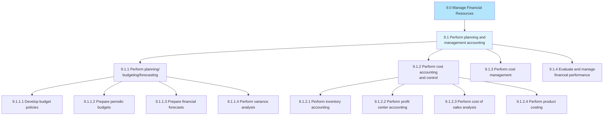
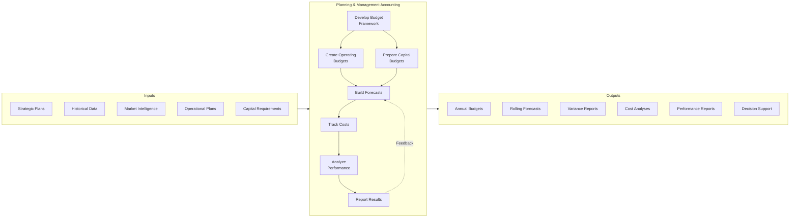

# Perform Planning and Management Accounting

*APQC Process Group 9.1*

> Determining different stages of the planning process and accounting. Classify, determine, analyze, interpret, and communicate information to make up-to-date business decisions for better management and control functions.

## Overview

Perform Planning and Management Accounting is the first process group within APQC Category 9.0 (Manage Financial Resources). This group encompasses all activities related to financial planning, budgeting, forecasting, cost accounting, and performance management. These processes translate strategic objectives into financial plans and provide the analytical foundation for business decision-making.

Management accounting differs from financial accounting in its forward-looking orientation and internal focus. While financial accounting reports historical results to external stakeholders, management accounting provides actionable insights to support operational and strategic decisions.

## Process Hierarchy



## Key Statistics

| Metric | Value |
|--------|-------|
| APQC Code | 10728 |
| Hierarchy ID | 9.1 |
| Level | Process Group |
| Category | [Manage Financial Resources](/processes/09-Finance) |
| Processes | 4 |
| Activities | 20+ |

## Process Flow



## GraphDL Semantic Structure

```
perform.PlanningAndManagementAccounting
```

| Component | Value | Description |
|-----------|-------|-------------|
| Verb | `perform` | Execute or carry out |
| Object | `PlanningAndManagementAccounting` | Financial planning and internal accounting |
| Preposition | - | Not applicable at group level |
| PrepObject | - | Not applicable at group level |

## Processes

### 9.1.1 - Perform planning/budgeting/forecasting

Allocating funds to meet future and current financial goals through systematic planning, budgeting, and forecasting processes.

[View Process Details](./PerformPlanningBudgetingForecasting)

### 9.1.2 - Perform cost accounting and control

Defining costs and methods for optimum utilization through systematic cost tracking and control mechanisms.

[View Process Details](./PerformCostAccounting)

### 9.1.3 - Perform cost management

Deciding which expenses can be avoided to reduce costs and increase revenues through active cost management.

[View Process Details](./PerformCostManagement)

### 9.1.4 - Evaluate and manage financial performance

Checking and achieving predetermined financial targets and timelines through performance evaluation.

[View Process Details](./EvaluateFinancialPerformance)

## RACI Matrix

| Activity | Responsible | Accountable | Consulted | Informed |
|----------|-------------|-------------|-----------|----------|
| Develop budget policies | FP&A Manager | CFO | Controller, Business Units | Executive Team |
| Prepare annual budgets | FP&A Analysts | FP&A Manager | Department Heads | Board |
| Create forecasts | FP&A Team | FP&A Manager | Operations | CFO |
| Perform cost accounting | Cost Accountants | Controller | Operations Managers | FP&A |
| Manage costs | Department Managers | Controller | Finance Business Partners | CFO |
| Evaluate performance | FP&A Analysts | CFO | Business Unit Leaders | Executive Team |

## Related Departments

- [Finance](/departments/Finance/index) - Primary process ownership
- [FP&A](/departments/FPA) - Financial planning and analysis execution
- [Operations](/departments/Operations/index) - Operational input and cost management
- [Strategy](/departments/Strategy/index) - Strategic planning alignment

## Related Occupations

- [Budget Analysts](/occupations/Business/Financial/BudgetAnalysts) - Budget development and monitoring
- [Financial Managers](/occupations/Management/FinancialManagers) - Overall process leadership
- [Cost Estimators](/occupations/Business/CostEstimators) - Cost analysis and estimation
- [Management Analysts](/occupations/Business/Operations/ManagementAnalysts) - Performance improvement

## Industry Variations

### Manufacturing

Manufacturing planning accounting emphasizes standard costing, variance analysis, and production cost tracking. Activity-based costing is common for overhead allocation.

**Industry-Specific Activities:**
- Develop standard costs for products
- Calculate manufacturing variances (material, labor, overhead)
- Perform activity-based costing
- Track work-in-process inventory costs

### Professional Services

Professional services focus on utilization metrics, project profitability, and resource planning. Time-based billing requires detailed cost tracking by project.

**Industry-Specific Activities:**
- Track billable vs. non-billable time
- Calculate project profitability
- Forecast resource utilization
- Manage partner compensation models

### Healthcare

Healthcare planning accounting manages service line profitability, payer mix analysis, and capacity planning. Cost-to-charge ratios are critical for reimbursement.

**Industry-Specific Activities:**
- Analyze service line profitability
- Calculate cost-to-charge ratios
- Plan capacity by service area
- Budget for regulatory compliance costs

## Sub-Processes

| Process | Code | Description |
|---------|------|-------------|
| [Perform planning/budgeting/forecasting](./PerformPlanningBudgetingForecasting) | 9.1.1 | Budget and forecast development |
| [Perform cost accounting and control](./PerformCostAccounting) | 9.1.2 | Cost tracking and control |
| [Perform cost management](./PerformCostManagement) | 9.1.3 | Active cost optimization |
| [Evaluate and manage financial performance](./EvaluateFinancialPerformance) | 9.1.4 | Performance analysis and management |

## Metrics & KPIs

| Metric | Description | Target |
|--------|-------------|--------|
| Forecast Accuracy | Variance between forecast and actual | >95% |
| Budget Cycle Time | Days to complete annual budget | <60 days |
| Rolling Forecast Updates | Frequency of forecast refresh | Monthly |
| Cost Variance | Actual vs. standard cost deviation | <5% |
| Budget Participation | % of departments meeting deadlines | 100% |
| Planning FTE Ratio | FP&A FTEs per $1B revenue | <10 |

---

*Source: APQC PCF 10728 (9.1) - Cross-Industry*
