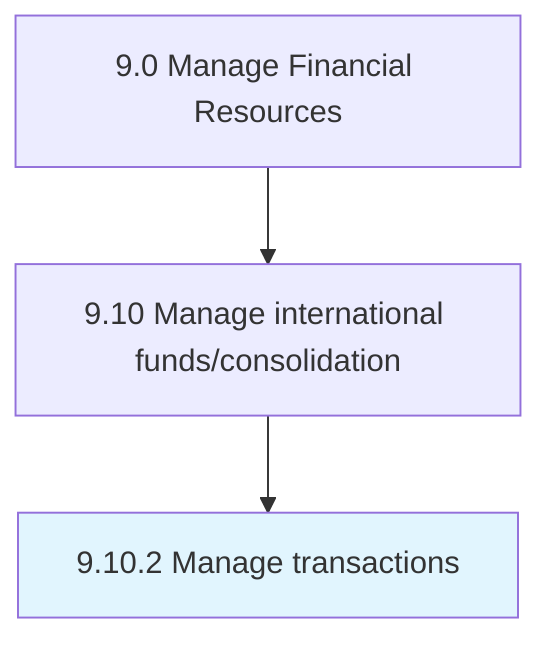

# Manage transactions

> Managing any transfer of funds in the course of conducting cross-border trades or investments, including conversion across currencies.

## Overview

Process 9.10.2 is a core process that defines the specific procedures for manage transactions. 

Managing any transfer of funds in the course of conducting cross-border trades or investments, including conversion across currencies. Find the most suitable alternative for making payments, while saving taxes and avoiding any unwarranted regulation, with the objective of protecting capital.

## Process Hierarchy



## Key Statistics

| Metric | Value |
|--------|-------|
| APQC Code | 10768 |
| Hierarchy ID | 9.10.2 |
| Level | Process |
| Parent | [9.10](../) |
| Sub-Processes | 0 |


## GraphDL Semantic Structure

```
manage.Transactions
```

| Component | Value | Description |
|-----------|-------|-------------|
| Verb | `manage` | Primary action |
| Object | `transactions` | Direct object |


## Related Concepts

- [Transactions](/concepts/Transactions)


---

*Source: APQC PCF 10768 (9.10.2) - APQC*
