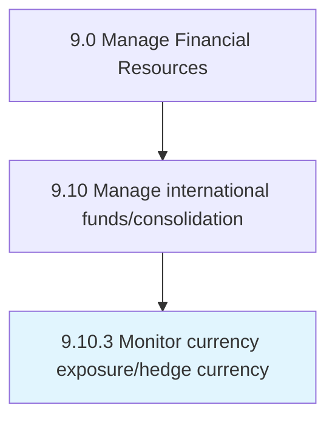

# Monitor currency exposure/hedge currency

> Assessing exposure to potential financial losses as a result of changes in the value of currencies.

## Overview

Process 9.10.3 is a core process that defines the specific procedures for monitor currency exposure/hedge currency. 

Assessing exposure to potential financial losses as a result of changes in the value of currencies. Forecast the impact of movements in foreign currency values. Enter into financial transactions designed to offset or limit potential exposure to loss.

## Process Hierarchy



## Key Statistics

| Metric | Value |
|--------|-------|
| APQC Code | 10769 |
| Hierarchy ID | 9.10.3 |
| Level | Process |
| Parent | [9.10](../) |
| Sub-Processes | 0 |


## GraphDL Semantic Structure

```
monitor.CurrencyExposurehedgeCurrency
```

| Component | Value | Description |
|-----------|-------|-------------|
| Verb | `monitor` | Primary action |
| Object | `currency exposure/hedge currency` | Direct object |


## Related Concepts

- [CurrencyExposureCurrency](/concepts/CurrencyExposureCurrency)
- [CurrencyHedgeCurrency](/concepts/CurrencyHedgeCurrency)


---

*Source: APQC PCF 10769 (9.10.3) - APQC*
