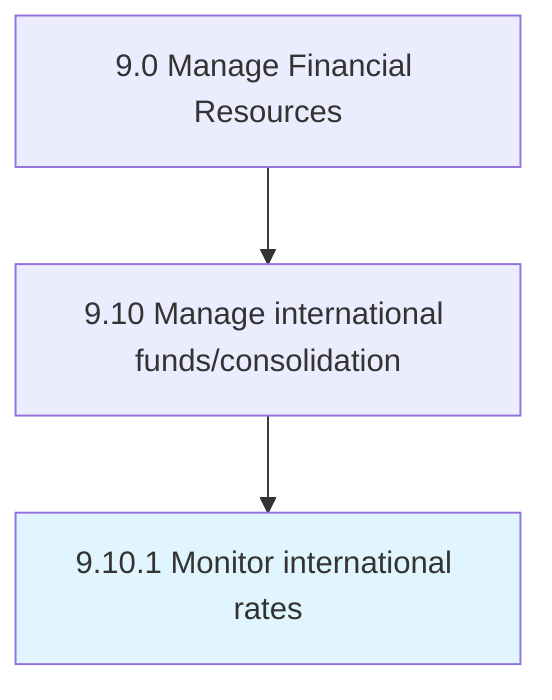

# Monitor international rates

> Forecasting and monitoring changes in foreign currency value or interest rates around the world that play an important role in the organization.

## Overview

Process 9.10.1 is a core process that defines the specific procedures for monitor international rates. 

Forecasting and monitoring changes in foreign currency value or interest rates around the world that play an important role in the organization.

## Process Hierarchy



## Key Statistics

| Metric | Value |
|--------|-------|
| APQC Code | 10767 |
| Hierarchy ID | 9.10.1 |
| Level | Process |
| Parent | [9.10](../) |
| Sub-Processes | 0 |


## GraphDL Semantic Structure

```
monitor.InternationalRates
```

| Component | Value | Description |
|-----------|-------|-------------|
| Verb | `monitor` | Primary action |
| Object | `international rates` | Direct object |


## Related Concepts

- InternationalRates


---

*Source: APQC PCF 10767 (9.10.1) - APQC*
