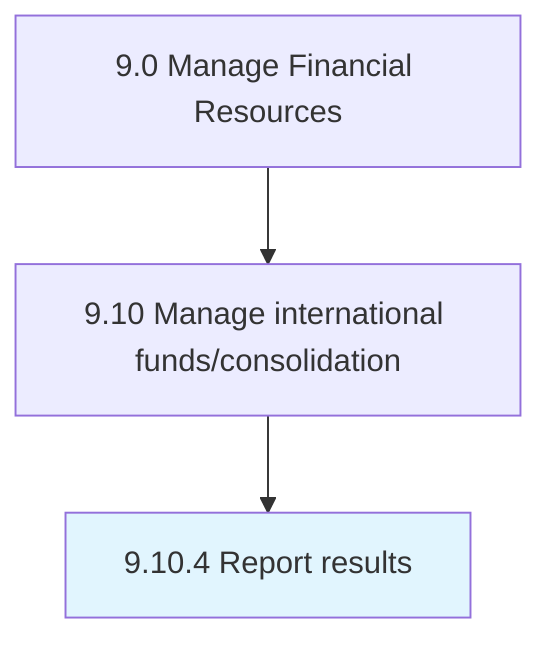

# Report results

> Documenting and reporting accounting entries to formally report financial gains or losses experienced as a result of foreign exchange activity.

## Overview

Process 9.10.4 is a core process that defines the specific procedures for report results. 

Documenting and reporting accounting entries to formally report financial gains or losses experienced as a result of foreign exchange activity.

## Process Hierarchy



## Key Statistics

| Metric | Value |
|--------|-------|
| APQC Code | 10770 |
| Hierarchy ID | 9.10.4 |
| Level | Process |
| Parent | [9.10](../) |
| Sub-Processes | 0 |


## GraphDL Semantic Structure

```
report.Results
```

| Component | Value | Description |
|-----------|-------|-------------|
| Verb | `report` | Primary action |
| Object | `results` | Direct object |


## Related Concepts

- [Results](/concepts/Results)


---

*Source: APQC PCF 10770 (9.10.4) - APQC*
