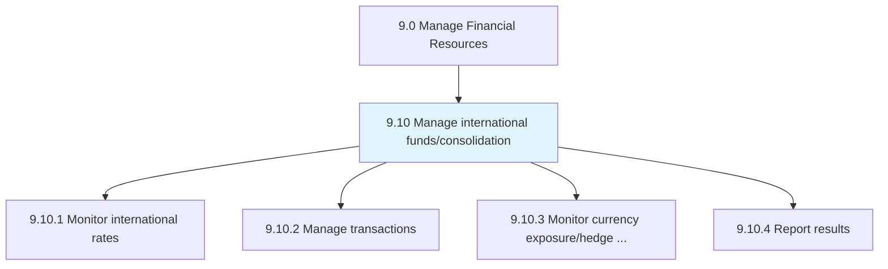
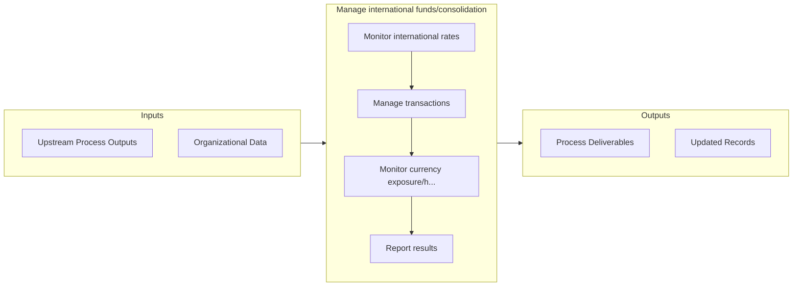

# Manage international funds/consolidation

> Managing cash collections and disbursements made by operating units across the enterprise.

## Overview

Group 9.10 is a process group within APQC Category 9.0 (Manage Financial Resources). 

Managing cash collections and disbursements made by operating units across the enterprise. When appropriate, transfer cash from the operating units to parent-level bank accounts managed by the organization's treasury team.

## Process Hierarchy



## Key Statistics

| Metric | Value |
|--------|-------|
| APQC Code | 10737 |
| Hierarchy ID | 9.10 |
| Level | Group |
| Parent | [9](../) |
| Sub-Processes | 4 |


## GraphDL Semantic Structure

```
manage.InternationalFundsconsolidation
```

| Component | Value | Description |
|-----------|-------|-------------|
| Verb | `manage` | Primary action |
| Object | `international funds/consolidation` | Direct object |


## Process Flow



## Sub-Processes

| Process | Hierarchy ID | Description |
|---------|-------------|-------------|
| [Monitor international rates](./MonitorInternationalRates) | 9.10.1 | Forecasting and monitoring changes in foreign currency value or interest rates around the world that |
| [Manage transactions](./ManageTransactions) | 9.10.2 | Managing any transfer of funds in the course of conducting cross-border trades or investments, inclu |
| [Monitor currency exposure/hedge currency](./MonitorCurrencyExposurehedgeCurrency) | 9.10.3 | Assessing exposure to potential financial losses as a result of changes in the value of currencies |
| [Report results](./ReportResults) | 9.10.4 | Documenting and reporting accounting entries to formally report financial gains or losses experience |


## Related Concepts

- InternationalFunds
- InternationalConsolidation


---

*Source: APQC PCF 10737 (9.10) - APQC*
