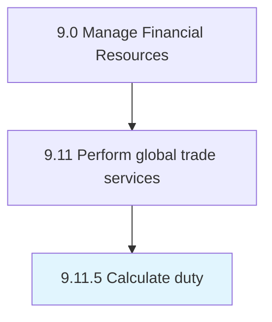

# Calculate duty

> Computing the excise duty to be paid during international trade.

## Overview

Process 9.11.5 is a core process that defines the specific procedures for calculate duty. 

Computing the excise duty to be paid during international trade.

## Process Hierarchy



## Key Statistics

| Metric | Value |
|--------|-------|
| APQC Code | 14093 |
| Hierarchy ID | 9.11.5 |
| Level | Process |
| Parent | [9.11](../) |
| Sub-Processes | 0 |


## GraphDL Semantic Structure

```
calculate.Duty
```

| Component | Value | Description |
|-----------|-------|-------------|
| Verb | `calculate` | Primary action |
| Object | `duty` | Direct object |


## Related Concepts

- Duty


---

*Source: APQC PCF 14093 (9.11.5) - APQC*
