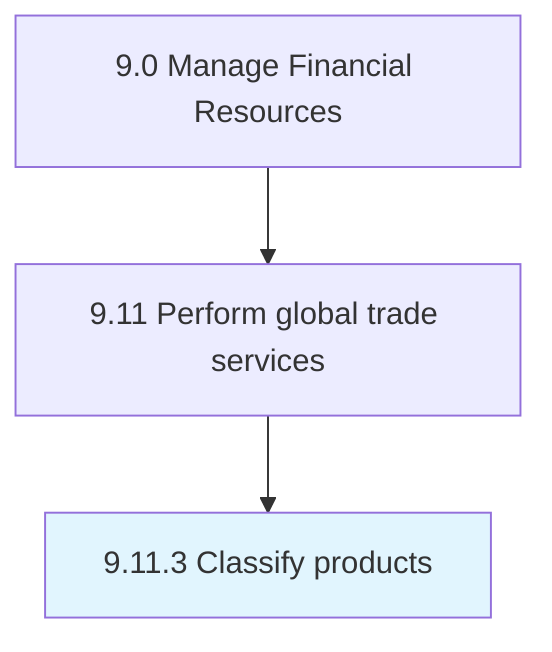

# Classify products

> Systematically categorizing products/services for their suitability to international trade.

## Overview

Process 9.11.3 is a core process that defines the specific procedures for classify products. 

Systematically categorizing products/services for their suitability to international trade. Create classes and categories for demarcating the types of products suitable for international trade. Study requisite national and international standards and the adherence of the organization's portfolio of offerings to these.

## Process Hierarchy



## Key Statistics

| Metric | Value |
|--------|-------|
| APQC Code | 14092 |
| Hierarchy ID | 9.11.3 |
| Level | Process |
| Parent | [9.11](../) |
| Sub-Processes | 0 |


## GraphDL Semantic Structure

```
classify.Products
```

| Component | Value | Description |
|-----------|-------|-------------|
| Verb | `classify` | Primary action |
| Object | `products` | Direct object |


## Related Concepts

- Products


---

*Source: APQC PCF 14092 (9.11.3) - APQC*
