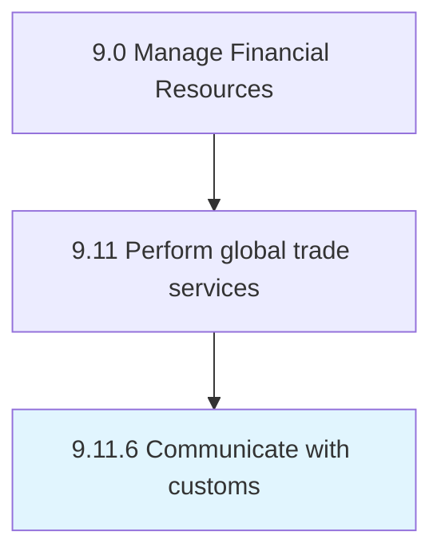

# Communicate with customs

> Communicating with the customs department to ensure fluid compliance.

## Overview

Process 9.11.6 is a core process that defines the specific procedures for communicate with customs. 

Communicating with the customs department to ensure fluid compliance. Share pertinent information mandated by law with the government agency that controls and collects the duties levied for the international exchange of products/services.

## Process Hierarchy



## Key Statistics

| Metric | Value |
|--------|-------|
| APQC Code | 14094 |
| Hierarchy ID | 9.11.6 |
| Level | Process |
| Parent | [9.11](../) |
| Sub-Processes | 0 |


## GraphDL Semantic Structure

```
communicate.WithCustoms
```

| Component | Value | Description |
|-----------|-------|-------------|
| Verb | `communicate` | Primary action |
| Object | `with customs` | Direct object |


## Related Concepts

- Customs


---

*Source: APQC PCF 14094 (9.11.6) - APQC*
