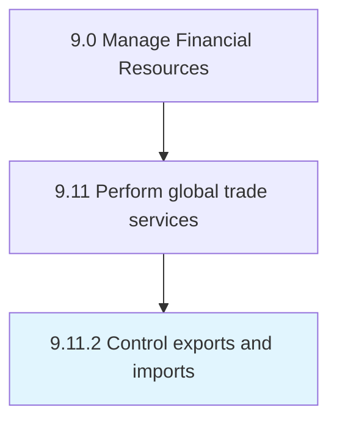

# Control exports and imports

> Overseeing and directing the flow of trade to/from the organization in order to ensure financial gains.

## Overview

Process 9.11.2 is a core process that defines the specific procedures for control exports and imports. 

Overseeing and directing the flow of trade to/from the organization in order to ensure financial gains.

## Process Hierarchy



## Key Statistics

| Metric | Value |
|--------|-------|
| APQC Code | 14091 |
| Hierarchy ID | 9.11.2 |
| Level | Process |
| Parent | [9.11](../) |
| Sub-Processes | 0 |


## GraphDL Semantic Structure

```
control.ExportsAndImports
```

| Component | Value | Description |
|-----------|-------|-------------|
| Verb | `control` | Primary action |
| Object | `exports and imports` | Direct object |


## Related Concepts

- [Exports](/concepts/Exports)
- [Imports](/concepts/Imports)


---

*Source: APQC PCF 14091 (9.11.2) - APQC*
