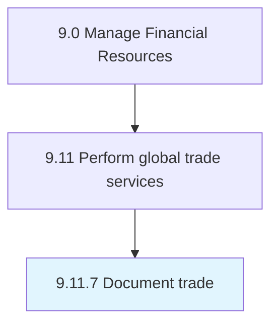

# Document trade

> Documenting and recording the trade processes while making transactions, noting the description, quality, number, transportation medium, indemnity, and inspection.

## Overview

Process 9.11.7 is a core process that defines the specific procedures for document trade. 

Documenting and recording the trade processes while making transactions, noting the description, quality, number, transportation medium, indemnity, and inspection.

## Process Hierarchy



## Key Statistics

| Metric | Value |
|--------|-------|
| APQC Code | 14095 |
| Hierarchy ID | 9.11.7 |
| Level | Process |
| Parent | [9.11](../) |
| Sub-Processes | 0 |


## GraphDL Semantic Structure

```
document.Trade
```

| Component | Value | Description |
|-----------|-------|-------------|
| Verb | `document` | Primary action |
| Object | `trade` | Direct object |


## Related Concepts

- [Trade](/concepts/Trade)


---

*Source: APQC PCF 14095 (9.11.7) - APQC*
