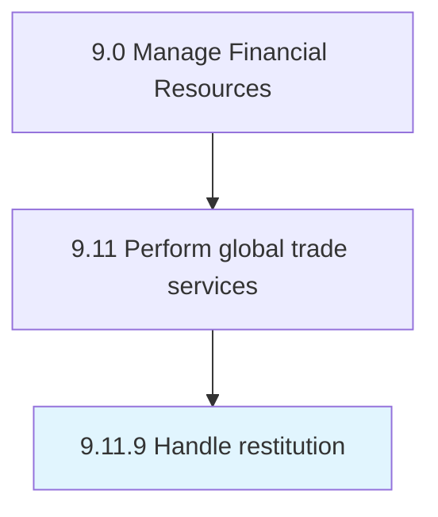

# Handle restitution

> Administering and overseeing all restitution activities the organization may be subjected to.

## Overview

Process 9.11.9 is a core process that defines the specific procedures for handle restitution. 

Administering and overseeing all restitution activities the organization may be subjected to. Manage compliance with apposite legal frameworks. Make any restitution that may be required by law; comply with authorities over any fines or non-financial measures imposed.

## Process Hierarchy



## Key Statistics

| Metric | Value |
|--------|-------|
| APQC Code | 14097 |
| Hierarchy ID | 9.11.9 |
| Level | Process |
| Parent | [9.11](../) |
| Sub-Processes | 0 |


## GraphDL Semantic Structure

```
handle.Restitution
```

| Component | Value | Description |
|-----------|-------|-------------|
| Verb | `handle` | Primary action |
| Object | `restitution` | Direct object |


## Related Concepts

- Restitution


---

*Source: APQC PCF 14097 (9.11.9) - APQC*
