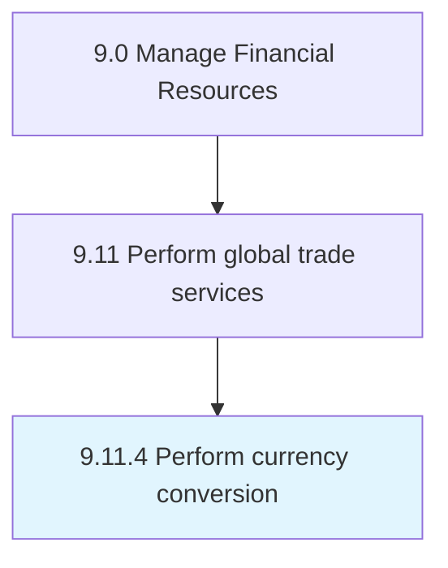

# Perform currency conversion

> Identifying current exchange rates between two currencies and converting the foreign currency to that of the local monetary unit.

## Overview

Process 9.11.4 is a core process that defines the specific procedures for perform currency conversion. 

Identifying current exchange rates between two currencies and converting the foreign currency to that of the local monetary unit. I.E., yen to US dollar.

## Process Hierarchy



## Key Statistics

| Metric | Value |
|--------|-------|
| APQC Code | 19593 |
| Hierarchy ID | 9.11.4 |
| Level | Process |
| Parent | [9.11](../) |
| Sub-Processes | 0 |


## GraphDL Semantic Structure

```
perform.CurrencyConversion
```

| Component | Value | Description |
|-----------|-------|-------------|
| Verb | `perform` | Primary action |
| Object | `currency conversion` | Direct object |


## Related Concepts

- CurrencyConversion


---

*Source: APQC PCF 19593 (9.11.4) - APQC*
