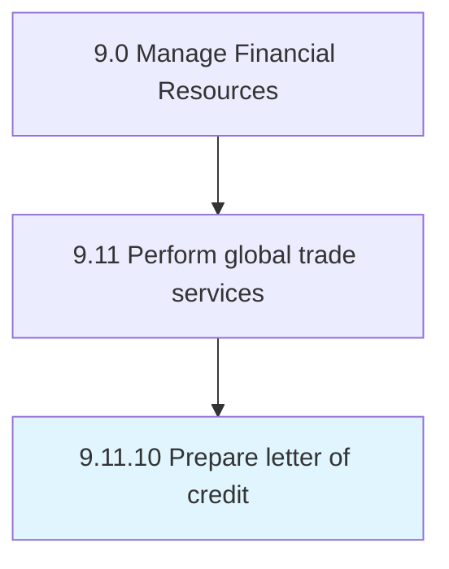

# Prepare letter of credit

> Creating a document assuring that a seller will receive payment when certain delivery conditions are met.

## Overview

Process 9.11.10 is a core process that defines the specific procedures for prepare letter of credit. 

Creating a document assuring that a seller will receive payment when certain delivery conditions are met. (If the buyer is unable to make payment on the purchase, a bank covers the outstanding amount.)

## Process Hierarchy



## Key Statistics

| Metric | Value |
|--------|-------|
| APQC Code | 14098 |
| Hierarchy ID | 9.11.10 |
| Level | Process |
| Parent | [9.11](../) |
| Sub-Processes | 0 |


## GraphDL Semantic Structure

```
prepare.Letter.of.Credit
```

| Component | Value | Description |
|-----------|-------|-------------|
| Verb | `prepare` | Primary action |
| Object | `letter` | Direct object |
| Preposition | `of` | Relationship |
| PrepObject | `credit` | Indirect object |


## Related Concepts

- [Letter](/concepts/Letter)
- [Credit](/concepts/Credit)


---

*Source: APQC PCF 14098 (9.11.10) - APQC*
