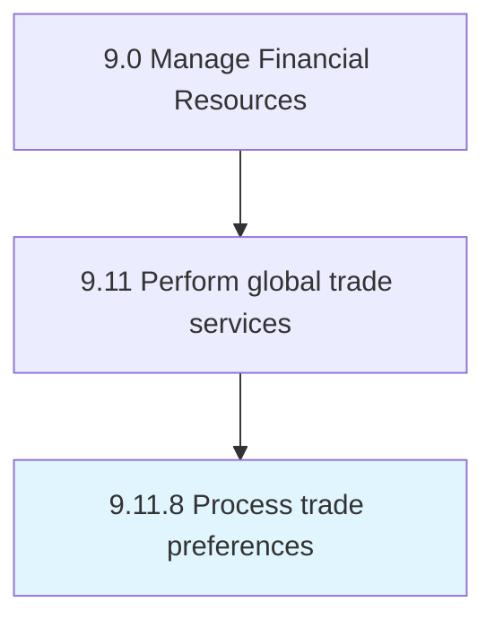

# Process trade preferences

> Preparing global trade under preference, which allows the organization to import/export products at a lower or nil rate of customs duty and/or levy charge.

## Overview

Process 9.11.8 is a core process that defines the specific procedures for process trade preferences. 

Preparing global trade under preference, which allows the organization to import/export products at a lower or nil rate of customs duty and/or levy charge.

## Process Hierarchy



## Key Statistics

| Metric | Value |
|--------|-------|
| APQC Code | 14096 |
| Hierarchy ID | 9.11.8 |
| Level | Process |
| Parent | [9.11](../) |
| Sub-Processes | 0 |


## GraphDL Semantic Structure

```
process.TradePreferences
```

| Component | Value | Description |
|-----------|-------|-------------|
| Verb | `process` | Primary action |
| Object | `trade preferences` | Direct object |


## Related Concepts

- TradePreferences


---

*Source: APQC PCF 14096 (9.11.8) - APQC*
