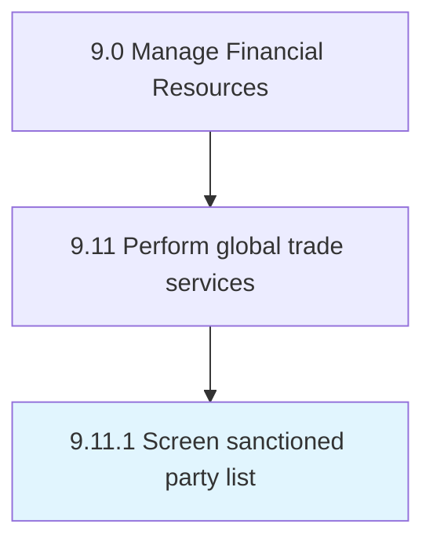

# Screen sanctioned party list

> Evaluating the approved list of parties for engaging in international trade in order to ensure the safety of the organization's business transactions.

## Overview

Process 9.11.1 is a core process that defines the specific procedures for screen sanctioned party list. 

Evaluating the approved list of parties for engaging in international trade in order to ensure the safety of the organization's business transactions. Examine agents that have been granted legal rights to engage in global trade and their credentials.

## Process Hierarchy



## Key Statistics

| Metric | Value |
|--------|-------|
| APQC Code | 14090 |
| Hierarchy ID | 9.11.1 |
| Level | Process |
| Parent | [9.11](../) |
| Sub-Processes | 0 |


## GraphDL Semantic Structure

```
screen.SanctionedPartyList
```

| Component | Value | Description |
|-----------|-------|-------------|
| Verb | `screen` | Primary action |
| Object | `sanctioned party list` | Direct object |


## Related Concepts

- [SanctionedPartyList](/concepts/SanctionedPartyList)


---

*Source: APQC PCF 14090 (9.11.1) - APQC*
