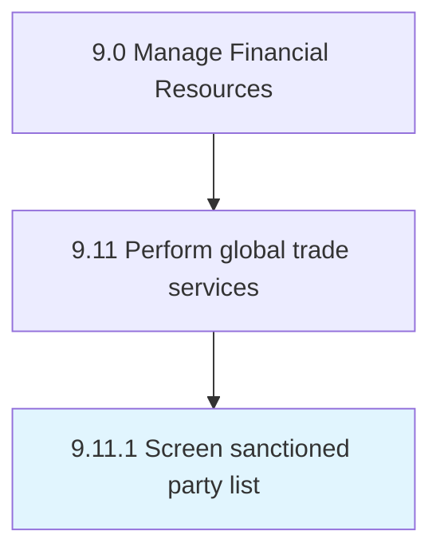
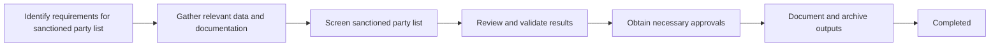

# Screen sanctioned party list

> Evaluating the approved list of parties for engaging in international trade in order to ensure the safety of the organization's business transactions.

## Overview

Activity 9.11.1 is an activity within the Financial Management domain of the Manage Financial Resources framework.

Evaluating the approved list of parties for engaging in international trade in order to ensure the safety of the organization's business transactions. This activity plays a critical role in ensuring that the organization maintains sound financial governance, operational efficiency, and regulatory compliance. It supports upstream planning and downstream execution by providing structured outputs that inform decision-making across finance and business operations. Effective execution of this activity requires coordination among finance professionals, process owners, and leadership stakeholders to ensure accuracy, timeliness, and alignment with organizational objectives.

## Process Hierarchy



## Process Flow



## Key Statistics

| Metric | Value |
|--------|-------|
| APQC Code | 14090 |
| Hierarchy ID | 9.11.1 |
| Level | Process |
| Parent | [9.11](../) |
| Sub-Processes | 0 |

## GraphDL Semantic Structure

```graphdl
screen.SanctionedPartyList
```

| Component | Value | Description |
|-----------|-------|-------------|
| Verb | `screen` | Primary action |
| Object | `sanctioned party list` | Direct object |

## RACI Matrix

| Activity | Responsible | Accountable | Consulted | Informed |
|----------|-------------|-------------|-----------|----------|
| Execute process | Finance Analyst | Finance Manager | Department Heads | CFO |
| Review and approve | Finance Manager | Controller | Compliance | Executive Team |
| Monitor and report | Finance Analyst | Finance Manager | Internal Audit | Controller |

## Related Occupations

- [Financial Managers](/occupations/Management/FinancialManagers)
- [Accountants and Auditors](/occupations/Business/Financial/AccountantsAndAuditors)
- [Financial Analysts](/occupations/Business/Financial/FinancialAnalysts)
- [Budget Analysts](/occupations/Business/Financial/BudgetAnalysts)
- [Compliance Officers](/occupations/Business/Operations/ComplianceOfficers)

## Related Departments

- Finance & Accounting
- Operations
- Executive Management

## Industry Variations

### Banking

Adapts to regulatory requirements including Basel III, Dodd-Frank, and FDIC reporting standards.

### Healthcare

Incorporates healthcare-specific compliance, reimbursement models, and clinical-financial integration.

### Manufacturing

Accounts for production cost structures, inventory valuation methods, and supply chain financial flows.

## KPIs & Metrics

| Metric | Description | Target |
|--------|-------------|--------|
| Process Cycle Time | Time to complete the process end-to-end | Below benchmark |
| Error Rate | Percentage of outputs requiring correction | < 1% |
| Cost Efficiency | Cost per transaction processed | Industry benchmark |
| Compliance Rate | Adherence to policies and regulations | > 99% |

## Related Concepts

- SanctionedPartyList

---

*Source: APQC PCF 14090 (9.11.1) - APQC*