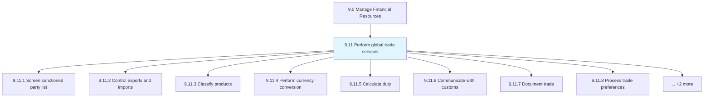
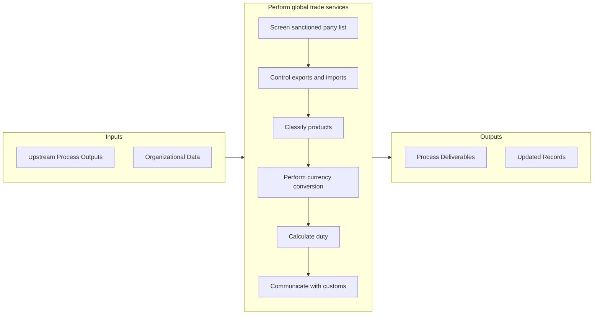

# Perform global trade services

> Making and collecting payments for transactions in products/services, and transporting them to interested markets.

## Overview

Group 9.11 is a process group within APQC Category 9.0 (Manage Financial Resources). 

Making and collecting payments for transactions in products/services, and transporting them to interested markets.

## Process Hierarchy



## Key Statistics

| Metric | Value |
|--------|-------|
| APQC Code | 17059 |
| Hierarchy ID | 9.11 |
| Level | Group |
| Parent | [9](../) |
| Sub-Processes | 10 |


## GraphDL Semantic Structure

```
perform.GlobalTradeServices
```

| Component | Value | Description |
|-----------|-------|-------------|
| Verb | `perform` | Primary action |
| Object | `global trade services` | Direct object |


## Process Flow



## Sub-Processes

| Process | Hierarchy ID | Description |
|---------|-------------|-------------|
| [Screen sanctioned party list](./ScreenSanctionedPartyList) | 9.11.1 | Evaluating the approved list of parties for engaging in international trade in order to ensure the s |
| [Control exports and imports](./ControlExportsAndImports) | 9.11.2 | Overseeing and directing the flow of trade to/from the organization in order to ensure financial gai |
| [Classify products](./ClassifyProducts) | 9.11.3 | Systematically categorizing products/services for their suitability to international trade |
| [Perform currency conversion](./PerformCurrencyConversion) | 9.11.4 | Identifying current exchange rates between two currencies and converting the foreign currency to tha |
| [Calculate duty](./CalculateDuty) | 9.11.5 | Computing the excise duty to be paid during international trade |
| [Communicate with customs](./CommunicateWithCustoms) | 9.11.6 | Communicating with the customs department to ensure fluid compliance |
| [Document trade](./DocumentTrade) | 9.11.7 | Documenting and recording the trade processes while making transactions, noting the description, qua |
| [Process trade preferences](./ProcessTradePreferences) | 9.11.8 | Preparing global trade under preference, which allows the organization to import/export products at  |
| [Handle restitution](./HandleRestitution) | 9.11.9 | Administering and overseeing all restitution activities the organization may be subjected to |
| [Prepare letter of credit](./PrepareLetterOfCredit) | 9.11.10 | Creating a document assuring that a seller will receive payment when certain delivery conditions are |


## Related Concepts

- [GlobalTradeServices](/concepts/GlobalTradeServices)


---

*Source: APQC PCF 17059 (9.11) - APQC*
