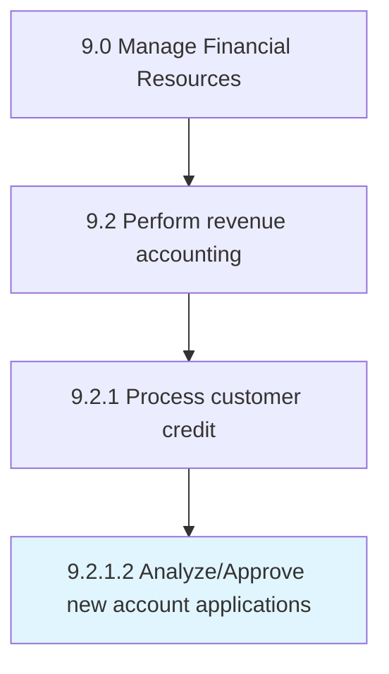

# Analyze/Approve new account applications

> Checking and accepting new requests based on eligibility criteria.

## Overview

Activity 9.2.1.2 is an activity within the Manage Financial Resources framework. 

Checking and accepting new requests based on eligibility criteria. Analyze the status of applicants and requirements to be met for a new account.

## Process Hierarchy



## Key Statistics

| Metric | Value |
|--------|-------|
| APQC Code | 10790 |
| Hierarchy ID | 9.2.1.2 |
| Level | Activity |
| Parent | [9.2.1](../) |
| Sub-Processes | 0 |


## GraphDL Semantic Structure

```
analyze/approve.NewAccountApplications
```

| Component | Value | Description |
|-----------|-------|-------------|
| Verb | `analyze/approve` | Primary action |
| Object | `new account applications` | Direct object |


## Related Concepts

- NewAccountApplications
- NewAccountApplications


---

*Source: APQC PCF 10790 (9.2.1.2) - APQC*
