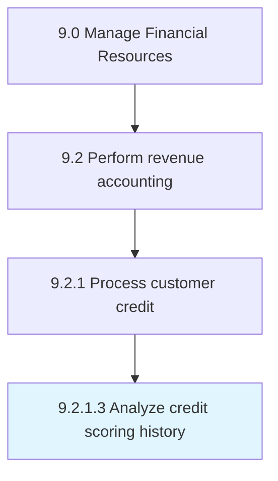

# Analyze credit scoring history

> Reviewing past credit scores to determine the if a line of credit will be extended to potential customers.

## Overview

Activity 9.2.1.3 is an activity within the Manage Financial Resources framework. 

Reviewing past credit scores to determine the if a line of credit will be extended to potential customers. This could also include extending additional credit to existing accounts.

## Process Hierarchy



## Key Statistics

| Metric | Value |
|--------|-------|
| APQC Code | 14187 |
| Hierarchy ID | 9.2.1.3 |
| Level | Activity |
| Parent | [9.2.1](../) |
| Sub-Processes | 0 |


## GraphDL Semantic Structure

```
analyze.CreditScoringHistory
```

| Component | Value | Description |
|-----------|-------|-------------|
| Verb | `analyze` | Primary action |
| Object | `credit scoring history` | Direct object |


## Related Concepts

- [CreditScoringHistory](/concepts/CreditScoringHistory)


---

*Source: APQC PCF 14187 (9.2.1.3) - APQC*
