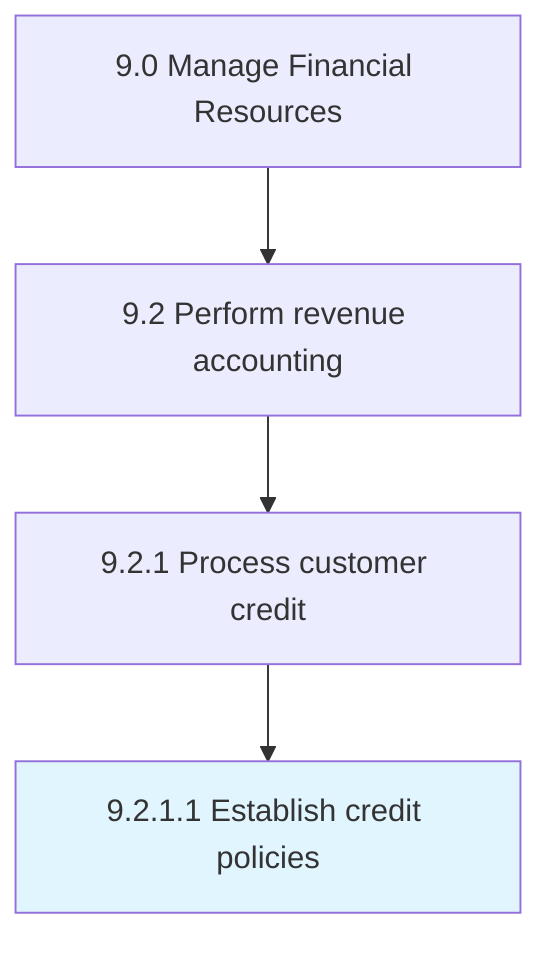

# Establish credit policies

> Creating guidelines for providing advances.

## Overview

Activity 9.2.1.1 is an activity within the Manage Financial Resources framework. 

Creating guidelines for providing advances. Set up credit standards, credit terms, and collection policies.

## Process Hierarchy



## Key Statistics

| Metric | Value |
|--------|-------|
| APQC Code | 10789 |
| Hierarchy ID | 9.2.1.1 |
| Level | Activity |
| Parent | [9.2.1](../) |
| Sub-Processes | 0 |


## GraphDL Semantic Structure

```
establish.CreditPolicies
```

| Component | Value | Description |
|-----------|-------|-------------|
| Verb | `establish` | Primary action |
| Object | `credit policies` | Direct object |


## Related Concepts

- [CreditPolicies](/concepts/CreditPolicies)


---

*Source: APQC PCF 10789 (9.2.1.1) - APQC*
