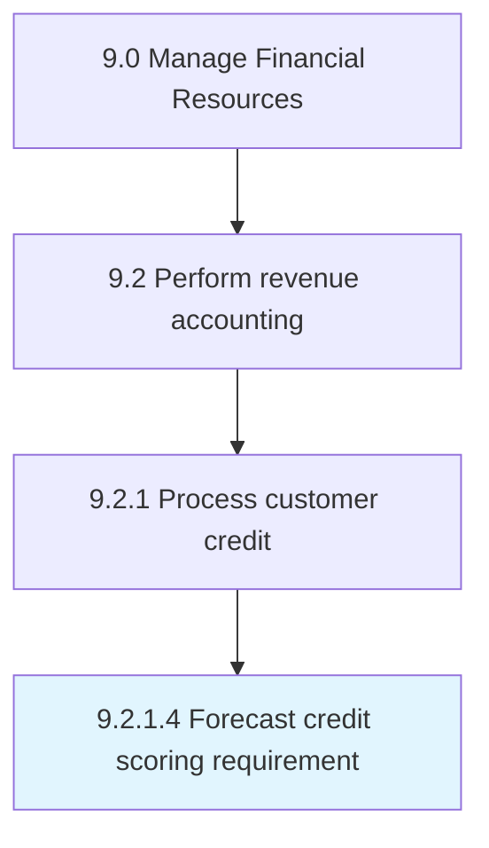

# Forecast credit scoring requirement

> Planning credit score requirements based on established credit policies.

## Overview

Activity 9.2.1.4 is an activity within the Manage Financial Resources framework. 

Planning credit score requirements based on established credit policies.

## Process Hierarchy



## Key Statistics

| Metric | Value |
|--------|-------|
| APQC Code | 14188 |
| Hierarchy ID | 9.2.1.4 |
| Level | Activity |
| Parent | [9.2.1](../) |
| Sub-Processes | 0 |


## GraphDL Semantic Structure

```
forecast.CreditScoringRequirement
```

| Component | Value | Description |
|-----------|-------|-------------|
| Verb | `forecast` | Primary action |
| Object | `credit scoring requirement` | Direct object |


## Related Concepts

- CreditScoringRequirement


---

*Source: APQC PCF 14188 (9.2.1.4) - APQC*
