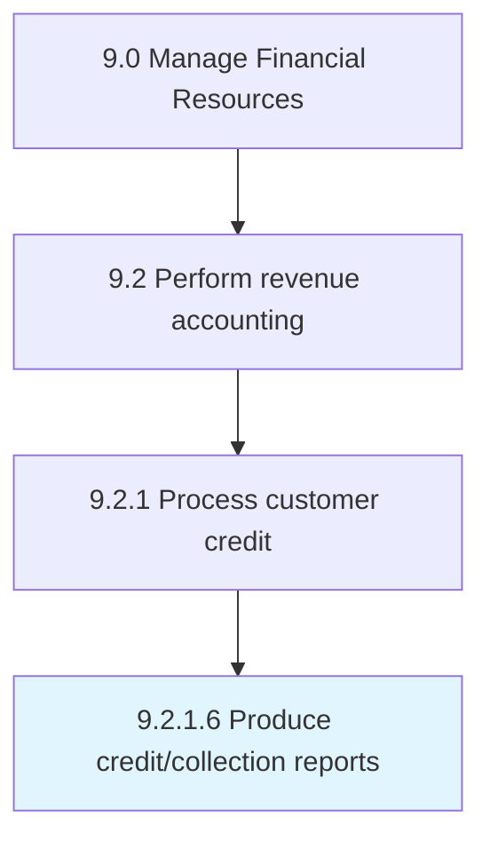

# Produce credit/collection reports

> Preparing account payable reports about payments to be made according to accounting rules and principles, and providing the reports to management.

## Overview

Activity 9.2.1.6 is an activity within the Manage Financial Resources framework. 

Preparing account payable reports about payments to be made according to accounting rules and principles, and providing the reports to management.

## Process Hierarchy



## Key Statistics

| Metric | Value |
|--------|-------|
| APQC Code | 10792 |
| Hierarchy ID | 9.2.1.6 |
| Level | Activity |
| Parent | [9.2.1](../) |
| Sub-Processes | 0 |


## GraphDL Semantic Structure

```
produce.CreditcollectionReports
```

| Component | Value | Description |
|-----------|-------|-------------|
| Verb | `produce` | Primary action |
| Object | `credit/collection reports` | Direct object |


## Related Concepts

- [CreditReports](/concepts/CreditReports)
- [CollectionReports](/concepts/CollectionReports)


---

*Source: APQC PCF 10792 (9.2.1.6) - APQC*
