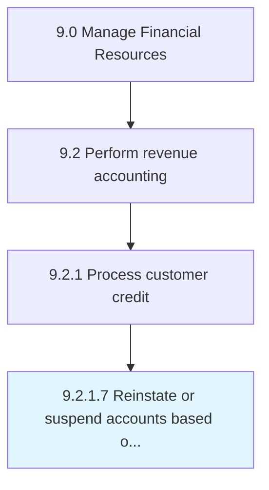

# Reinstate or suspend accounts based on credit policies

> Closing or restarting accounts according to changes made in credit policies.

## Overview

Activity 9.2.1.7 is an activity within the Manage Financial Resources framework. 

Closing or restarting accounts according to changes made in credit policies.

## Process Hierarchy



## Key Statistics

| Metric | Value |
|--------|-------|
| APQC Code | 10793 |
| Hierarchy ID | 9.2.1.7 |
| Level | Activity |
| Parent | [9.2.1](../) |
| Sub-Processes | 0 |


## GraphDL Semantic Structure

```
reinstate.OrSuspendAccountsBased.on.CreditPolicies
```

| Component | Value | Description |
|-----------|-------|-------------|
| Verb | `reinstate` | Primary action |
| Object | `or suspend accounts based` | Direct object |
| Preposition | `on` | Relationship |
| PrepObject | `credit policies` | Indirect object |


## Related Concepts

- [AccountsBased](/concepts/AccountsBased)
- [CreditPolicies](/concepts/CreditPolicies)
- [AccountsBased](/concepts/AccountsBased)
- [CreditPolicies](/concepts/CreditPolicies)


---

*Source: APQC PCF 10793 (9.2.1.7) - APQC*
