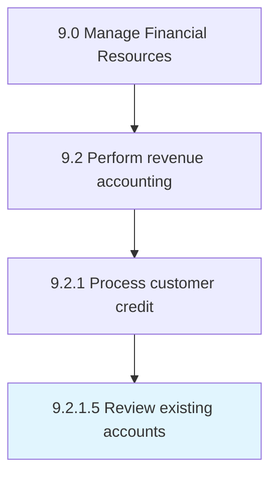

# Review existing accounts

> Evaluating existing account holders and their past performance.

## Overview

Activity 9.2.1.5 is an activity within the Manage Financial Resources framework. 

Evaluating existing account holders and their past performance. Regularly review existing accounts to get the required information about the status at present.

## Process Hierarchy



## Key Statistics

| Metric | Value |
|--------|-------|
| APQC Code | 10791 |
| Hierarchy ID | 9.2.1.5 |
| Level | Activity |
| Parent | [9.2.1](../) |
| Sub-Processes | 0 |


## GraphDL Semantic Structure

```
review.ExistingAccounts
```

| Component | Value | Description |
|-----------|-------|-------------|
| Verb | `review` | Primary action |
| Object | `existing accounts` | Direct object |


## Related Concepts

- [ExistingAccounts](/concepts/ExistingAccounts)


---

*Source: APQC PCF 10791 (9.2.1.5) - APQC*
