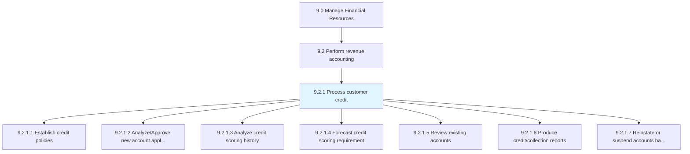
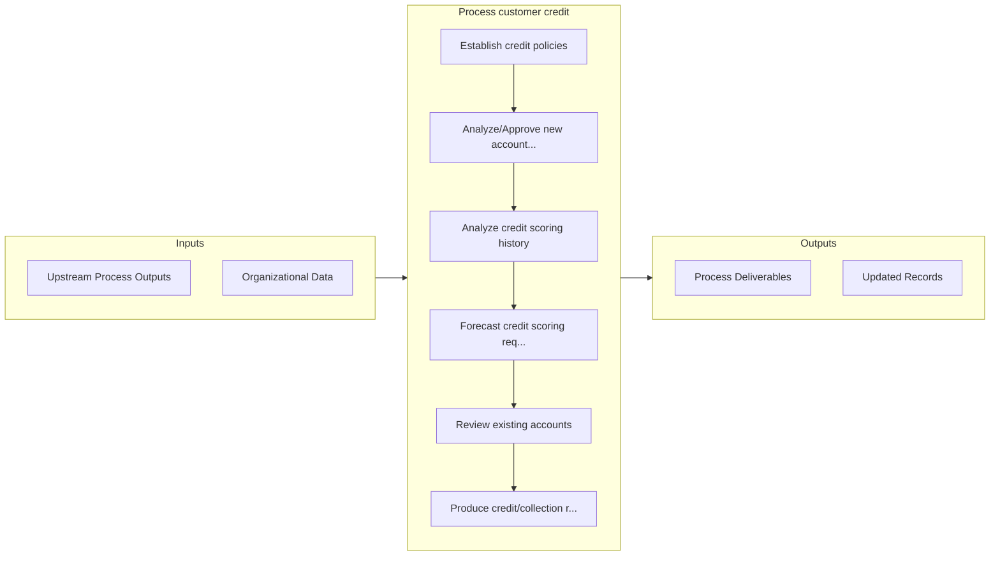

# Process customer credit

> Evaluating and processing requests for advances.

## Overview

Process 9.2.1 is a core process that defines the specific procedures for process customer credit. 

Evaluating and processing requests for advances. Evaluate credit requests by customers requiring loans to buy products/services.

## Process Hierarchy



## Key Statistics

| Metric | Value |
|--------|-------|
| APQC Code | 10742 |
| Hierarchy ID | 9.2.1 |
| Level | Process |
| Parent | [9.2](../) |
| Sub-Processes | 7 |


## GraphDL Semantic Structure

```graphdl
process.CustomerCredit
```

| Component | Value | Description |
|-----------|-------|-------------|
| Verb | `process` | Primary action |
| Object | `customer credit` | Direct object |


## Process Flow



## Sub-Processes

| Process | Hierarchy ID | Description |
|---------|-------------|-------------|
| [Establish credit policies](./EstablishCreditPolicies) | 9.2.1.1 | Creating guidelines for providing advances |
| [Analyze/Approve new account applications](./AnalyzeApproveNewAccountApplications) | 9.2.1.2 | Checking and accepting new requests based on eligibility criteria |
| [Analyze credit scoring history](./AnalyzeCreditScoringHistory) | 9.2.1.3 | Reviewing past credit scores to determine the if a line of credit will be extended to potential cust |
| [Forecast credit scoring requirement](./ForecastCreditScoringRequirement) | 9.2.1.4 | Planning credit score requirements based on established credit policies |
| [Review existing accounts](./ReviewExistingAccounts) | 9.2.1.5 | Evaluating existing account holders and their past performance |
| [Produce credit/collection reports](./ProduceCreditcollectionReports) | 9.2.1.6 | Preparing account payable reports about payments to be made according to accounting rules and princi |
| [Reinstate or suspend accounts based on credit policies](./ReinstateOrSuspendAccountsBasedOnCreditPolicies) | 9.2.1.7 | Closing or restarting accounts according to changes made in credit policies |


## Related Concepts

- CustomerCredit


---

*Source: APQC PCF 10742 (9.2.1) - APQC*
